## 2024年第一期（20240722）

### 资料

- RAG
  - [retrieval-augmented generation (RAG)](https://www.oracle.com/sg/artificial-intelligence/generative-ai/retrieval-augmented-generation-rag/)
  - [What is RAG?](https://www.databricks.com/glossary/retrieval-augmented-generation-rag)
  - [RAG Arch](https://developers.cloudflare.com/reference-architecture/diagrams/ai/ai-rag/)

- 搜索资料又发现了一个有趣的 pdf 书库，现在把 GitHub 当网盘的朋友越来越多了😄 看了一眼东西还是很多的，有兴趣的可以翻翻看
  - https://github.com/sunnyregion/Books
- [斯坦福大学刚刚发布了免费在线课程](https://x.com/xiaoying_eth/status/1816297364426219981)。无需付费。

- Go语言入门，我推荐的阅读顺序： 
  - 《Go语言趣学指南》 
  - 《Go标准库》
  - 《Go语言实战》
  - 《Go语言设计与实现》

- 王德峰老师 1996 年的《智慧之光：世界十大思想家》重版出来。以《西方哲学思想讲义》为名上架，望知悉。

- [让大模型拥有超强记忆力的 Mem0 火了](https://www.bestblogs.dev/en/article/0211e2)

  - https://github.com/mem0ai/mem0

  本文介绍了一款名为 Mem0 的开源 AI 记忆技术，该技术开源后迅速获得了广泛关注。Mem0 旨在为大语言模型提供智能、自我改进的记忆层，实现跨应用的个性化 AI 体验。其核心功能包括多层次记忆、自适应个性化、开发者友好的 API 和跨平台一致性。

  与传统的 RAG 技术相比，Mem0 在实体关系理解、上下文连续性、自适应学习和动态更新信息等方面具有显著优势。Mem0 安装和使用简便，提供了易于操作的 API，适用于虚拟陪伴、生产力工具和 AI Agent 客户支持等多种 AI 应用场景。文章还介绍了 Mem0 的技术细节、应用案例以及与 RAG 的区别，并提供了一些简单的代码示例。

  主要内容:
  1. Mem0 的核心功能 -- Mem0 为大语言模型提供了一个智能、自我改进的记忆层，实现了跨应用的个性化 AI 体验，例如记住用户的偏好、过去的交互、事情的进展等，为应用构建适应性的学习体验。

  2. Mem0 与 RAG 的比较 -- Mem0 在实体关系理解、上下文连续性、自适应学习和动态更新信息等方面优于 RAG，能够更好地理解和关联不同交互中的实体，优先考虑最近的交互，并逐渐忘记过时的信息，确保记忆保持相关和最新。

  3. Mem0 的应用场景 -- Mem0 适用于虚拟陪伴、生产力工具、健康关怀或 AI Agent 客户支持等多种场景，例如可以作为虚拟伴侣，根据用户的历史信息进行个性化的对话；或作为生产力工具，根据用户之前的操作和偏好，提供更智能的建议和帮助。

  4. Mem0 的开源和受欢迎程度 -- Mem0 开源不到一天就获得了 9.7k 颗星，显示了其在全球范围内的受欢迎程度，证明了其在 AI 记忆技术领域的价值和潜力。

  5. Mem0 的开发者友好性 -- Mem0 提供了开发者友好的 API，安装和使用简单，便于开发者快速集成和应用，降低了开发者使用 AI 记忆技术的门槛。

- Raycast-G4F  一个 Raycast 扩展 免费使用强大的 GPT-4、Llama-3、Gemini 和更多 AI 模型 - 无需 API 密钥  Raycast 的 AI 操作方式我不习惯，也没有测试。
  - https://github.com/XInTheDark/raycast-g4f

- 阿里的低代码agent开发工具：AgentScope
  AgentScope是一款老工具了，不过现在已经支持以拖拽的方式构建多智能体应用

  特点：
  1、非常容易上手， 有丰富的组件和指南，兼容性好； 
  同时还提供了在线拖拉拽编程和在线小助手(copilot)功能，可以帮助开发者迅速上手

  2、支持以中心化的方式构建分布式多智能体应用程序，简化开发流程

  3、AgentScope 提供 ModelWrapper 列表，支持本地模型和第三方模型API，OpenAI API、DashScope API、Gemini API、ZhipuAI API、Ollama、LiteLLM API 等

  4、支持网络搜索、数据查询、检索、代码执行、文件操作、文本处理、多模态等服务

  样例应用：
  与gpt-4o模型对话：https://github.com/modelscope/agentscope/tree/main/examples/conversation_with_gpt-4o
  与SoftWare Engineering智能体对话：https://github.com/modelscope/agentscope/tree/main/examples/conversation_with_swe-agent

  github：https://github.com/modelscope/agentscope
  在线使用：https://agentscope.io

- 要站在世界角度看中国，不要站在中国的角度看世界--马骏

- 蚂蚁集团支付宝开源了数字人技术：EchoMimic，可用于虚拟主播、视频编辑等
  效果比SadTalker、MuseTalk好，表情更丰富动作更顺畅

  EchoMimic是一个基于音频驱动的肖像动画生成工具，通过可编辑的特征点条件生成逼真、自然的动画，用户可以根据自己的需求调整动画细节

  功能:
  1、音频驱动动画，可以根据音频生成人物肖像的动画，比如唱歌、说话视频等
  2、姿势驱动动画，可以根据姿势数据生成人物肖像的动画
  3、音频和姿势混合驱动动画，可以同时使用音频和姿势数据来生成动画
  4、WebUI 和 GradioUI，提供图形界面，易于使用

  项目：https://badtobest.github.io/echomimic.html
  github：https://github.com/BadToBest/EchoMimic
  模型：https://huggingface.co/BadToBest/EchoMimic

- REAL TIME ARTIFICIAL INTELLIGENCE，[fixie.ai](https://fixie.ai/)

- Ollama YouTube 视频总结器 一款利用本地 AI (Ollama 服务器) 生成视频摘要的简单 YouTube 脚本。在观看视频前生成摘要可以帮助用户判断是否值得花时间一看。

  - https://github.com/HariTrigger/OllamaYTSumm

- 腾讯的 PhotoMaker 更新到第二版本了，拥有更好保真度及可控性！

  无需训练 LoRA，只需上传几张人物照片，即可生成多种风格且逼真的人物图像。

  v2 版本更高的保真度，同时新增支持使用 T2I-Adapter 适配器，提升对图像的可控性。

  GitHub：https://github.com/TencentARC/PhotoMaker
  在线体验：https://huggingface.co/spaces/TencentARC/PhotoMaker-V2

- 实用网站推荐：ExplainThis 一个专门为软件工程师和求职者提供面试题目和详解的平台。涵盖各种前端面试题库、后端面试题库，以及深入详解，还有及面试经验分享、技巧和策略等。同时也提供职业建议和资源，各种资讯信息，还有各种AI工具导航和使用教程。 链接：[https://explainthis.io/zh-hans](https://t.co/31ollmuLeS)

- Folyd
  - 1/3正式发布 [http://query.rs](https://t.co/r00hXQDIKH)！这是一个专门为 Rust 打造的搜索引擎，现在支持标准库文档、crates、第三方 crate 文档、Rust 书籍和各种 Rust 相关资料的搜索，其中一个功能是可以根据 type signature 搜索，比如找一个把 Vec 转成 usize 的函数可以用 vec -> usize，类似 Haskell 的 Hoogle。
  - 2/3你也可以把自己经常搜索的 crate 加进来，然后直接在输入框搜索相关文档
  - 3/3这个项目是我过去几个月每周末泡在硅谷的各个图书馆写出来的，我在硅谷待了将近半年，最喜欢的是硅谷的各个图书馆，[http://query.rs](https://t.co/r00hXQDIKH) 主要在 Cupertino，Mountain View，Sunnyvale, Los Altos 这几个图书馆里面写的代码

- web3 学习路线图
  - https://learnblockchain.cn/maps/Roadmap

- `llama-agents` is an async-first framework for building, iterating, and productionizing multi-agent systems, including multi-agent communication, distributed tool execution, human-in-the-loop, and more!
  - https://github.com/run-llama/llama-agents
- 《YoYo：我在通往AGI的学习之路心得》感谢 YoYo 同学的投稿，来自她作为「通往 AGI 之路」知识库的初学者体验，也希望能够给更多新人以帮助，我特别喜欢她用画板建立的学习路径，非常直观！
  - https://waytoagi.feishu.cn/wiki/FocUwAf9JiwBCckDJ5iclq56nKb

- [How to Read  a Paper](https://www.cs.cornell.edu/~stanleycelestin/HowtoReadPaper.pdf)
- Github 上发现一个宝藏项目，如果你也讨厌写 bash 脚本，一定要试试 amber-lang，现代化的语法结构，自带的类型安全。以后写 bash 再也不用搜来搜去，东拼西凑了。推荐！ 
  - https://amber-lang.com
- [Usenet Archives](https://yarchive.net/home.html)
  - https://yarchive.net/comp/index.html

- https://copybook.me/
- Valkey/Redis: Not-So-Good Practices
  - https://www.percona.com/blog/valkey-redis-not-so-good-practices/
- cloudflare 这些关于网络的文章真有意思，非常接地气，就是通过实验去验证然后再去学那些理论、源码
  - https://blog.cloudflare.com/when-the-window-is-not-fully-open-your-tcp-stack-is-doing-more-than-you-think
- GitHub - ahrm/sioyek: Sioyek is a PDF viewer with a focus on textbooks and research papers
  - https://github.com/ahrm/sioyek
- 中文版《事实核查手册》来啦！
  - https://chinafactcheck.com/?p=11465
- Ollama 架构解析
  - https://blog.inoki.cc/2024/04/16/Ollama-cn/
- 开发人员如何编写你的第一本技术书籍：工具、技术和资源
  - https://www.freecodecamp.org/chinese/news/how-to-write-your-first-technical-book/
- HackerNews 发现一个很棒的工具：**SVG Viewer**  编辑 SVG 使用的，用了一下发现真的很实用，已经放到收藏夹了。 https://svgviewer.dev 这类工具已经很多了，不过这个还有点不一样，图标很全，中间可以直接编辑SVG 代码，以及做一些简单的操作（缩放，旋转，直接编辑源代码），右侧可以使用不同格式。

- 从源码编译 openjdk
  - https://openjdk.org/groups/build/doc/building.html

### 播客

- [EP57 跟着哥飞学SEO和做网站养老 | 对话哥飞](https://www.xiaoyuzhoufm.com/episode/6626585b200abebe6e851af0)

### 远程工作

- https://about.gitlab.com/company/all-remote/

### 英语

- https://siphon.ink/

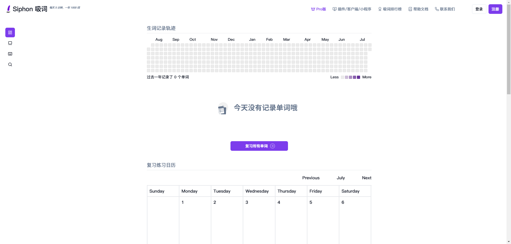

- 英语学习法：A.J. Hoge 的秘籍 今天分享外网很火的英语大神 A.J. Hoge 的英语学习法。 他在全世界各个国家教英语二十多年，发现英语学不好是一个世界性的问题。 无数学生死磕很多年，英语依旧稀烂，尤其在几个亚洲国家，这根本上是教学系统的问题。 学习的七个核心要点:

​	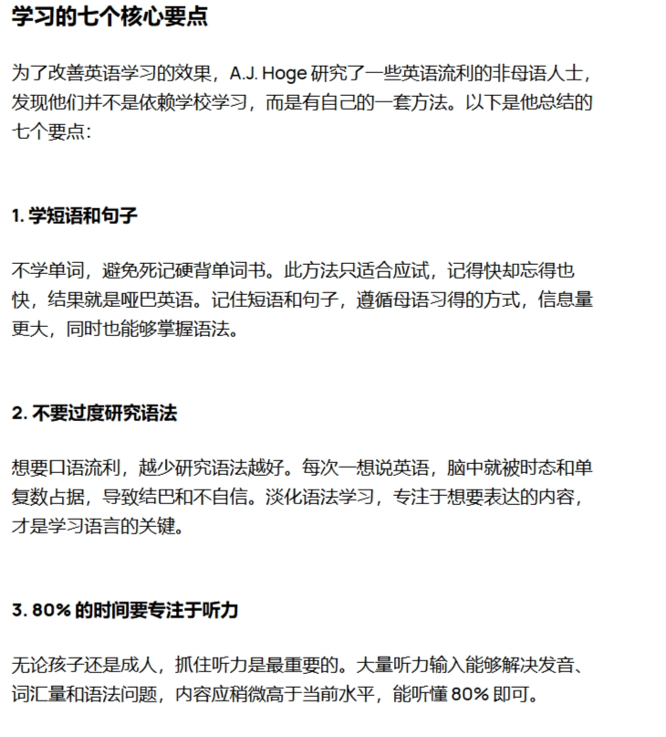

 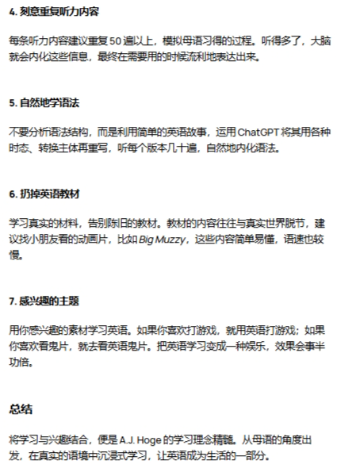

- **最适合独立开发者的英语学习教程**

  - https://www.freecodecamp.org/learn/a2-english-for-developers/

  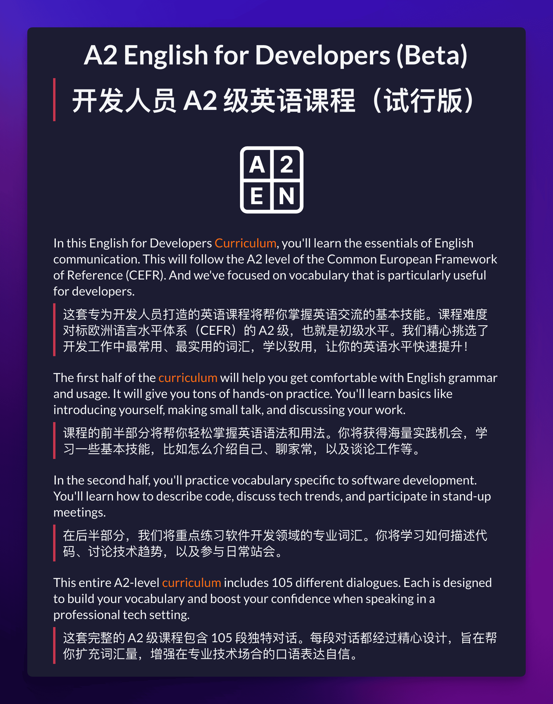

- 可理解输入英语学习法的补充

  Makoto 是一位会说中日英三门语言的日本人，在分享 comprehensible input 英语学习方法后，做了一个视频补充说明几点。

  这个方法最有争议的地方是没有强调输出的重要性，但他认为大量的母语输入仍然极其重要，光看单词、语法是没有办法真正学习一门语言的。
  https://youtube.com/watch?v=QmpaMAgsGiU

- english learning

  - https://github.com/hehonghui/awesome-english-ebooks

- 研究了一通，发现这个 Oxford 3000 and 5000  很权威，决定把它的分级词汇表练习房间做出来。 它的介绍很自信，就一句话：这是学习英语最重要的词汇。 

  - https://oxfordlearnersdictionaries.com/wordlists/

### 书籍

- 深入架构原理与实践
  - https://www.thebyte.com.cn/

- https://github.com/careywyr/UnderstandingDeepLearning-ZH-CN

  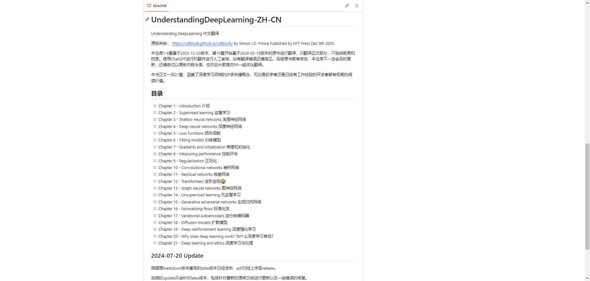

- [《c++之美》](https://book.douban.com/subject/36867886/)

- 理解深度学习

  - https://udlbook.github.io/udlbook/

  - https://github.com/udlbook/udlbook/

- 这个讲 [Visual Thinking 的系列视频](https://www.youtube.com/playlist?list=PL6mqgtMZ4NP3eRqCpNfipGGFNQZHlB4tv)值得看看，可以学习如何用好白板工具。视频博主是 Obsidian 知名插件 Excalidraw 的作者。

- 鸢尾花书

  - https://github.com/Visualize-ML

### 好玩

- [通过百练大模型+FC函数计算构建小红书图文工作流](https://developer.aliyun.com/article/1570271)

- 又一个 Cuda 挑战者！新 GPU 编程范式来了？🔥 前 Google DeepMind 大牛基于 WebGPU 开源了一个使用 C++ 操作 GPU 的库 - gpu.cpp，短时间暴涨 1.1K Star ⭐️

  - 1~2 秒即可完成编辑、编译！
  - M1 Max 可以激发 2.5 TFLOPS 的算力👍🏻
  - 基于 llm.c 后续可以支持训练端侧模型
  - https://github.com/AnswerDotAI/gpu.cpp
- Virtual Machine for the Web
  - https://webvm.io/
  - https://github.com/leaningtech/webvm
- 最近看到的 LLM 最全课程 🔥，从数据准备，特征处理，训练流水线到推理部署，最后再结合训练的 LLM 构建一个 RAG 应用！端到端课程配备代码和文字教程 🤯 感觉可以出书了
  - https://github.com/decodingml/llm-twin-course
- https://github.com/jordan-cutler/path-to-senior-engineer-handbook
- Printing music with CSS Grid
  - https://cruncher.ch/blog/printing-music-with-css-grid/

### Blog

- 如何写好一篇技术笔记
  - https://www.usmacd.com/cn/how_to_write_technique_note/
- 陈皓金句
  - https://airy-lunch-c6f.notion.site/9fdbf0612fe941639b68b5b4da1df256
  - https://github.com/haoel
  - https://github.com/megaease/Remembering-Haoel
  - https://coolshell.org/
  - **https://coolshell.cn/**
- 阮一峰的技术周刊
  - https://ruanyf-weekly.vercel.app/
  - https://www.ruanyifeng.com/blog/
  - https://github.com/ruanyf/weekly
- 如何选择合适的数据库（一）：对比MariaDB和PostgreSQL
  - https://huangz.blog/2024/mariadb-vs-postgresql.html
  - https://huangz.blog/index.html
- 健宏创作脑图聚合
  - https://huangz.works/mindmap/#

### 大模型

- Meta 亲自下场教学 Llama 3.1 Agentic App？无需使用 Agent 框架，Llama 3.1 自动执行多步规划，推理和工具调用！
  - https://github.com/meta-llama/llama-agentic-system

- Awesome Chinese LLM - 一个中文大型语言模型（LLM）资源库，收集并分享小规模、可私有化部署且训练成本较低的模型，为研究人员、开发者和中文大模型爱好者提供便捷的信息来源。
  - https://github.com/HqWu-HITCS/Awesome-Chinese-LLM

### 提示词工程

- 从评估的视角深入实践 Prompt Engineering，微软开源 Prompt 评估框架 - PromptBench，目前 2K Star ⭐️

  1. 对各种 Prompt Engineering 方法评估：CoT、EP、Zero/Few Shot、Least to most、GK 等
  2. 支持对抗提示和动态评估以减轻潜在的测试数据污染
  3. 支持多种数据集、模型

  - https://github.com/microsoft/promptbench

### 工具

- https://grep.app/

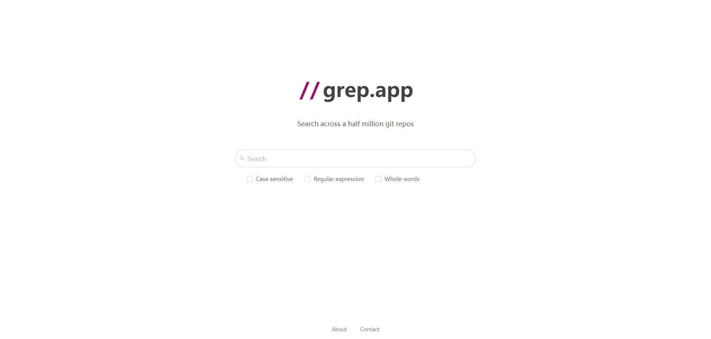

- https://stackedit.io/

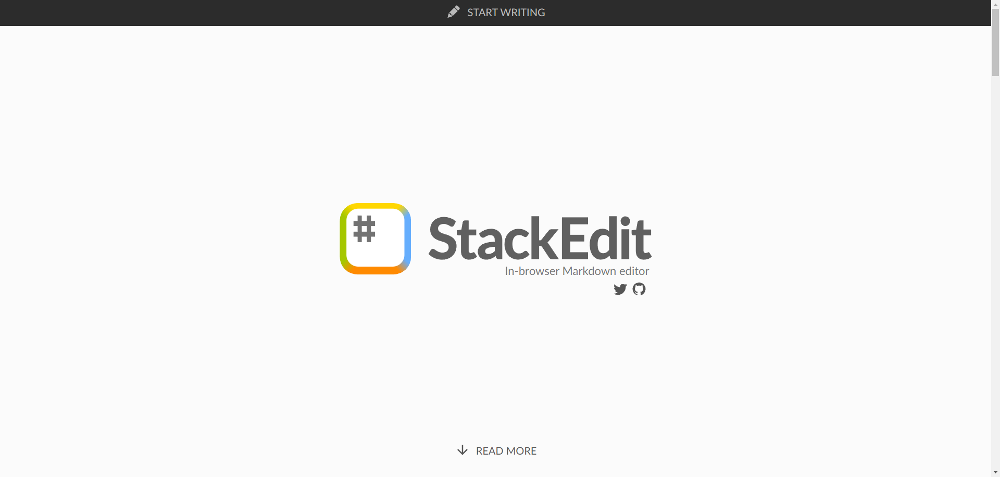

- https://github.com/dgmjs/dgmjs

- 一个快速将音视频转结构化笔记的开源免费工具： [AudioNotes](https://github.com/harry0703/AudioNotes)。 基于 FunASR 和 Qwen2 构建，可快速提取音视频内容，并利用大模型能力整理成一份结构化的 Markdown 笔记，方便快速阅读。 

- https://www.iamwawa.cn/

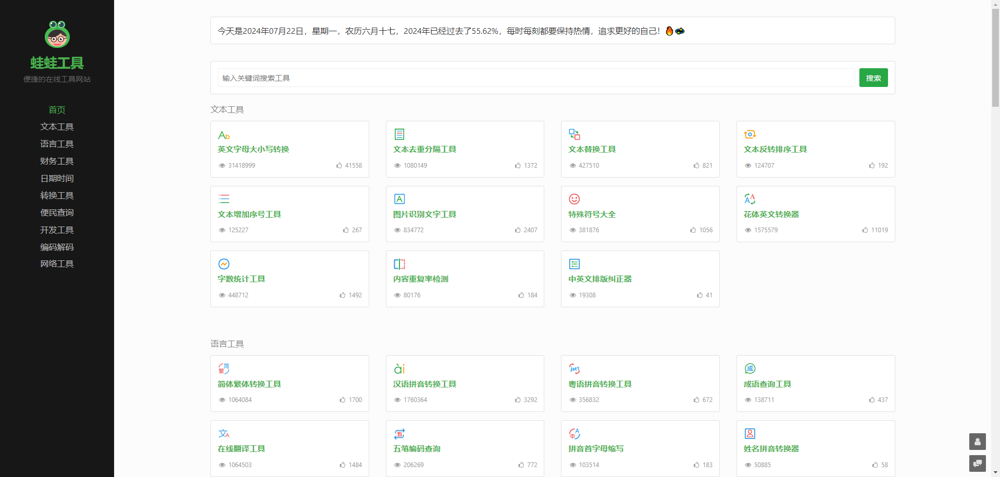

- https://markdown.com.cn/
- markdown 在线编辑器：https://markdown.com.cn/editor/

- Ollama 支持工具调用了，官方仓库的 example 还挺多。 什么叫学习的捷径？这就是。
  - https://github.com/ollama/ollama-python/tree/main/examples

- Linux的epub电子书阅读器
  - https://github.com/johnfactotum/foliate
- 可视化的电子邮件设计工具
  - https://github.com/SendWithSES/Drag-and-Drop-Email-Designer
- Album AI（图三）：对个人相册建立本地AI聊天索引
  - https://github.com/gcui-art/album-ai
  - http://album.gcui.ai/
- 使用Android原生开发的电视直播软件
  - https://github.com/yaoxieyoulei/mytv-android

- **Whimsical** 是我用过最好用的画原型和流程图的工具，非常 intuitive， 用起来非常舒服，界面简洁美观，我的课程一直用的都是它，最近打开，发现现在免费版好像能创建无限个 board 了，简直是太良心了，一般个人用免费版足足够用了。

  - https://whimsical.com/

- Notion 的开源替代

  - https://github.com/mayneyao/eidos
  - https://eidos.space

- 趣站推荐：ShowCode ShowCode是一款以将代码生成精美图片进行分享的工具。 支持多种代码，可调整相关参数进行个性化设置，有多个主题，真不戳！

  - https://showcode.app/

- **ComfyUI的升级工具：Comfy Deploy Quick Edit，一键编辑任何ComfyUI 工作流程，无需本地 GPU** Comfy Deploy实现了无需本地部署confyui，即可在线实现confyui的diy，并且可以通过api接口随时调用 **特点：** 

  - 1、托管平台，托管的 ComfyUI 工作区，可以安装任意自定义节点和模型 
  - 2、团队协作，支持团队工作区，方便团队成员无缝协作，共享、编辑和运行工作流程 
  - 3、可扩展的基础设施，按需提供强大的云 GPU，并自动扩展以满足团队的需求 
  - 4、即时部署，只需一键即可将 ComfyUI 工作流程转换为可扩展的、生产就绪的 API，无需额外的工程工作，提供多语言 SDK
  - https://www.ycombinator.com/launches/LQO-comfy-deploy-comfyui-for-product-teams
  - https://www.comfydeploy.com/
  - https://github.com/BennyKok/comfyui-deploy

- Cobalt - 超强音频视频下载工具 cobalt 是一个不会让您烦恼的媒体下载器。它速度快，友好，并且没有现代网络充斥的任何废话：没有广告，跟踪器或侵入性分析。 粘贴链接，获取文件，继续。就这么简单。就应该如此。

  - https://github.com/imputnet/cobalt
  - https://cobalt.tools/

- [简单简历](https://easycv.cn/)

- 使用 Devv VSCode 来阅读代码，效果非常好！

  - https://devv.ai
  - 有 VS Code 插件

- 新笔记 《使用 Obsidian 进行知识管理》

  - https://github.com/obsidianmd/obsidian-releases

- Felo Search  现在支持追问功能，帮助用户精确提问，直到找到准确答案。

  🔍http://felo.ai

- JetBrains 系列全家桶激活服务器 (每日更新) 

  - [https://jetbrains.asiones.com](https://t.co/NV2dOfpLwR)

- https://github.com/Stirling-Tools/Stirling-PDF

- https://github.com/exo-explore/exo

  - Run your own AI cluster at home with everyday devices 📱💻 🖥️⌚

### 软件

- https://openalternative.co/

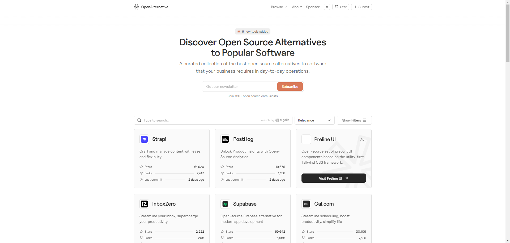

- https://pandao.github.io/editor.md/en.html

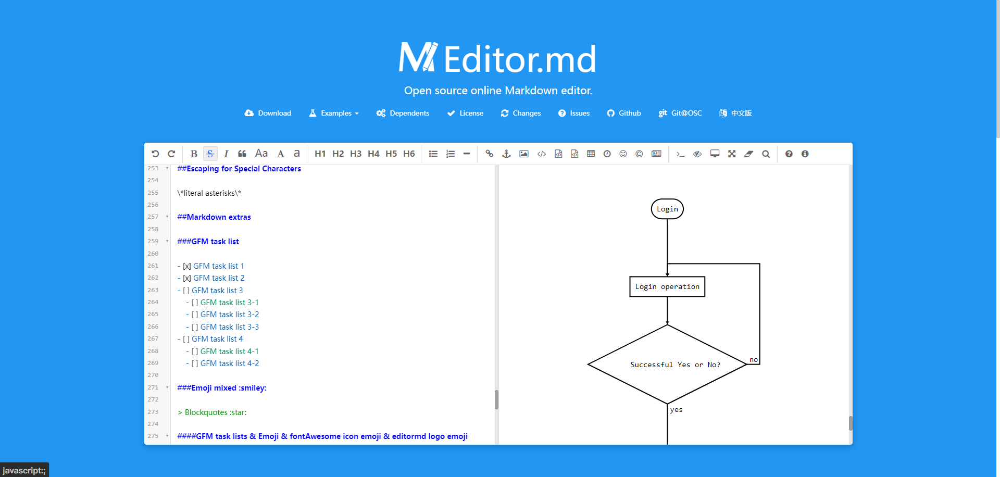

- https://github.com/microsoft/graphrag

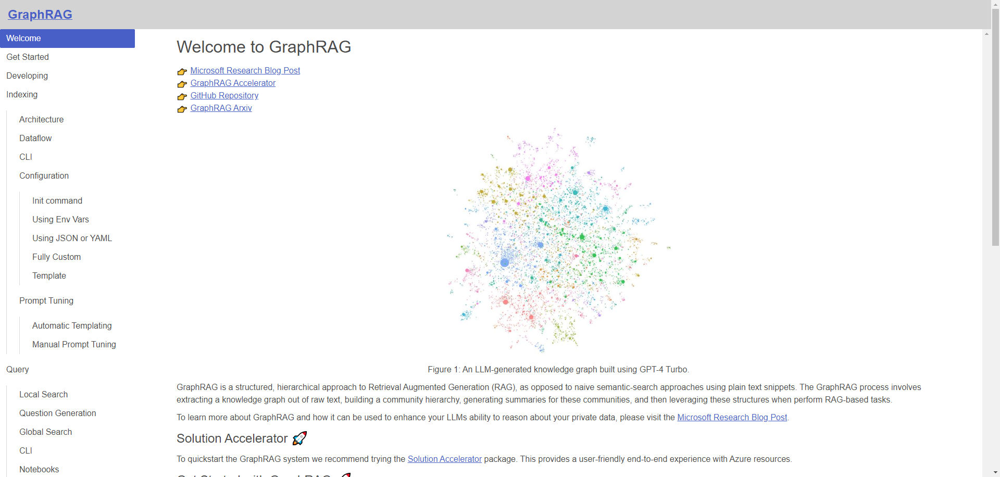

- 当你还在用原生 fetch 的时候，可以考虑使用 **ky**
  - https://github.com/sindresorhus/ky
  - https://github.com/axios/axios
  - https://www.zenrows.com/alternative/axios
  - https://github.com/alovajs/alova
- Sniffnet 这款用来监控网络流量的软件 UI 越来越好看了
  - https://sniffnet.net/
  - https://github.com/GyulyVGC/sniffnet

### UI 字体

- Free Font —— 收录商用免费字体(汉字英文字体)
  - https://wangchujiang.com/free-font/
  - https://github.com/jaywcjlove/free-font

- UI/UX Designers, this might be the best color generator out there.  
  - https://uicolors.app/create

- 怎么用 AI 创造最佳配色方案

  https://colorai.app

  - 虽然有各种 AI 配色工具，但它们都无法解决一个问题：

    - 如果使用者（比如独立开发者程序员）自己不懂色彩理论、缺少审美观，那 ta 怎么从 AI 生成的那么多配色，选择一个最好的配色方案？

    - ColorAI 不但按你的文字描述生成配色方案，而且详细介绍用户看到这个配色之后，生理、心理感官上有什么感觉，以及文化上有什么体验

    - 一旦了解了配色方案的效果和寓意，完全不懂设计的人也能选出最好的配色方案

  - 从“技术实现”的层面说，这个 ColorAI 和一般设计类 AI 有点不同，它创造配色方案时利用了设计理论里的“色彩理论”，而不只是依靠无数训练数据来找到规律或者换句话说，现在绝大部分设计类 AI 是由不懂设计的程序员主导的，一般就是先用强大的 LLM AI 实现基本功能，再找设计师来试用、提意见和提建议… 这些设计类 AI 本质上基于统计学，蛮力的确能出奇迹，但只靠蛮力就浪费了已有的设计规律/设计原理，要知道这些规律/原理是艺术家、设计师从几千年人类历史中整理出来的，是人类共同智慧的抽象、提炼和升华 我很期待更多像 ColorAI 这样，有设计师直接参与、理解设计师思维方式、能利用已有设计原理和策略的设计类 AI 工具

- The largest Open-Source UI Library! Community-made and free to use. Made with either CSS or Tailwind.
  - https://github.com/uiverse-io/galaxy

