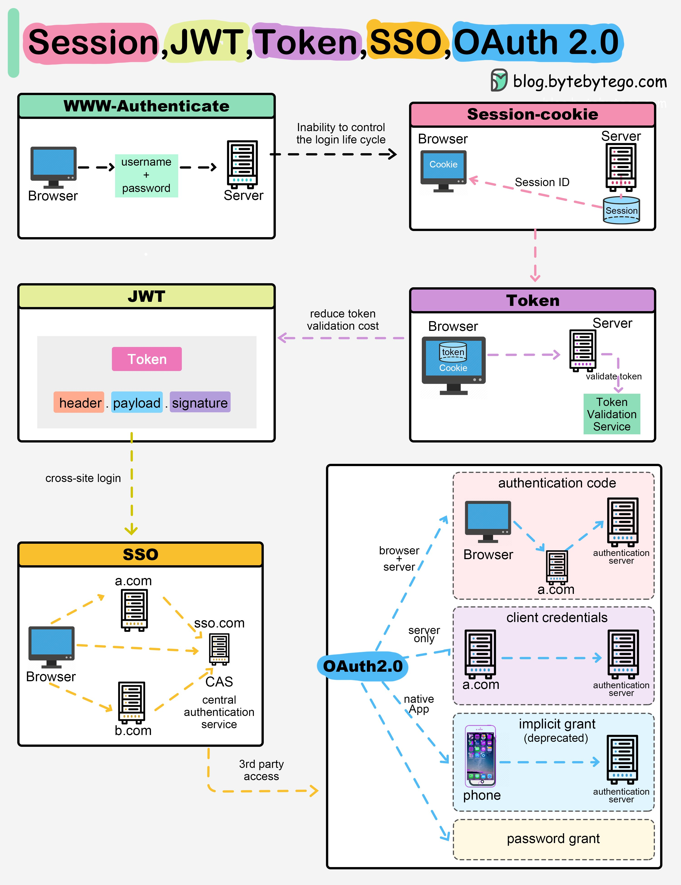
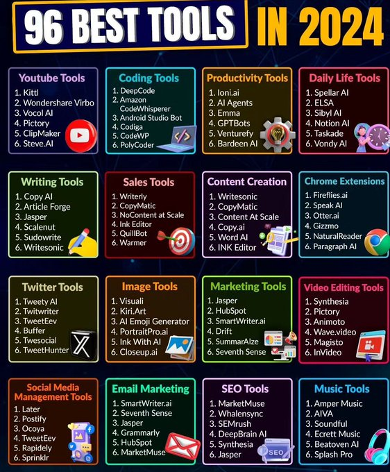
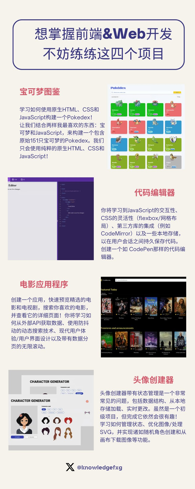
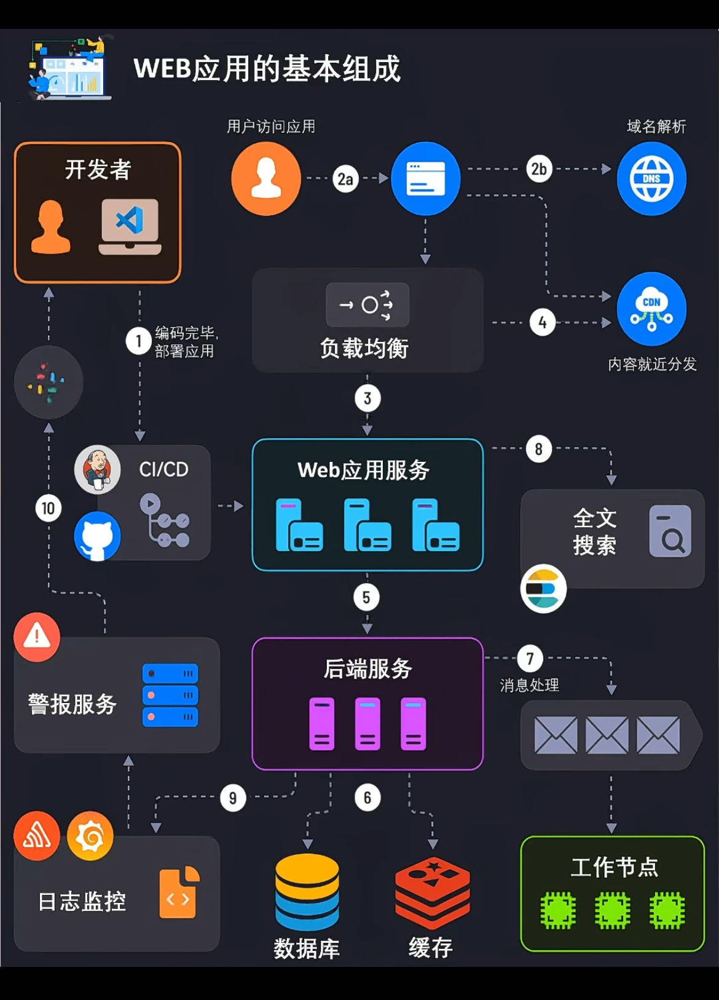

# 20240803 总结

## 大模型

- https://github.com/rasbt/LLMs-from-scratch
  - Implementing a ChatGPT-like LLM in PyTorch from scratch, step by step

- https://huggingface.co/stvlynn/Gemma-2-2b-Chinese-it
  - `Gemma-2-2b-中文`使用了约6.4k弱智吧数据对`Gemma-2-2b-it`进行微调
- https://github.com/camenduru/flux-jupyter
  - flux - image to image - free colab
- https://www.comfy.org/
  - Open source AI model will win over the long run against closed models and we are only at the beginning. Yet if open source models can only be utilized by a handful of cloud providers or closed sourced tools, is AI truly democratized? Our core mission is to advance and democratize AI tooling. We believe that the future of AI tooling is open-source and community-driven.

- MindSearch：能够模仿人类在网络上寻找和整合信息的AI搜索引擎

  MindSearch能够在3分钟内从超过300个网页中收集和整合信息，这相当于人类专家大约3小时的工作量。

  在深度、广度和生成响应的准确性三个方面，其在人类专家评估中都超越了； Perplexity AI和 ChatGPT。

  在所有任务中表现最优，特别是在开源模型中展示了其增强知识和减少幻觉的能力。

  项目地址：https://mindsearch.netlify.app
  GitHub：https://github.com/InternLM/MindSearch

- FLUX 真梦幻开头！！！目前社区发展汇总

  1）ComfyUI 原生支持：https://comfyanonymous.github.io/ComfyUI_examples/flux/
  2）我的各种工作流（陆续发出）：https://github.com/ZHO-ZHO-ZHO/ComfyUI-Workflows-ZHO
  3）fp8 模型（12GB VRAM 运行）：https://huggingface.co/Kijai/flux-fp8
  4）Colab 免费层支持：https://x.com/camenduru/status/1819231326962094474
  5）Pallaidium（Blender 插件） 24GB VRAM 运行：https://x.com/tintwotin/status/1819280703550271561
  6） deforum discord 已支持 FLUX.1 PRO：https://x.com/deforum_art/status/1819075111804457446

- [Introducing GitHub Models: A new generation of AI engineers building on GitHub](https://github.blog/news-insights/product-news/introducing-github-models/)

  - https://github.com/marketplace/models/

- https://dify.ai/

  - The Innovation Engine for GenAI Applications

- 建议有 GitHub 账号的去申请 GitHub Models 的 Waitlist，可以免费测试各个大模型，当然会有使用限制，个人的话每天限制150次，每分钟不能超过15次，每次 Token 上限8000 in, 4000 out。

  申请地址：https://github.com/marketplace/models
  相关说明：https://docs.github.com/en/github-models/prototyping-with-ai-models#rate-limits

- Web/iOS/Android 本地运行的 MLC-LLM 发布🔥！开源并获得 18K Star 🌟

  - 基于 WASM/WebGPU 运行 Web 端推理
  - 基于 OpenCL/Metal 运行 Android/iOS GPU 推理

  支持完善教程！查看开源地址：https://github.com/mlc-ai/mlc-llm

- https://build.nvidia.com/explore/discover

- ODYSSEY：Minecraft智能体框架
  基于LLaMA-3微调，与现有的Minecraft智能体相比，动作集更全，有一定的开放世界探索能力。同时开源了数据集，包括39万条来自Minecraft Wiki的指令。
  Github：https://github.com/zju-vipa/odyssey

- dify 官方文档：https://docs.dify.ai/v/zh-hans

### 语音

- TTS模型汇总：
  1、GPT-SoVITS（AI 卖货主播大模型Streamer-Sales销冠用的这款TTS模型，https://x.com/aigclink/status/1805405022932681139）
  支持英语、日语和中文，零样本文本到语音（TTS），集成工具包
  github：https://github.com/RVC-Boss/GPT-SoVITS

  2、Fish Speech v1.2
  效果稳定非常好，支持克隆语音。经过 30 万小时的英语、中文和日语音频数据的训练。
  模型：https://huggingface.co/fishaudio/fish-speech-1.2
  在线版：https://fish.audio/zh-CN/

  3、字节的Seed-TTS（不开源）
  支持多种语言包括英语、中文，能够进行同语言生成和跨语言生成 
  能处理各种文本，叙述性文本、情感表达、描述性文本等，能根据不同的情感和语境生成相应的语音
  项目：https://bytedancespeech.github.io/seedtts_tech_report/

  4、ChatTTS
  对话式 TTS（可多人），支持中英文，韵律细腻
  github：https://github.com/2noise/ChatTTS
  模型：https://huggingface.co/2Noise/ChatTTS/tree/main

  5、HuggingFace的Parler-TTS
  可以控制音调、速度、性别、噪音水平、情绪特征等等
  github：https://github.com/huggingface/parler-tts
  模型：https://huggingface.co/parler-tts

  6、MetaVoice-1B
  支持多语言，在英语处理上实现了情感语音节奏
  github：https://github.com/metavoiceio/metavoice-src

  7、MARS5-TTS
  MARS5可以为体育解说、动漫等韵律复杂和多样化的场景生成语音
  github：https://github.com/Camb-ai/MARS5-TTS

  8、OpenVoice
  原生支持英语、西班牙语、法语、中文、日语和韩语，具有灵活的语音风格控制和零样本跨语言语音克隆能力。
  github：https://github.com/myshell-ai/OpenVoice

  9、EmotiVoice
  支持中英文双语，包含2000多种不同的音色
  github：https://github.com/netease-youdao/EmotiVoice/blob/main/README.zh.md

### 教育

- AI在教育领域中的一个应用
  未来的教育助手：可以在看教学视频的过程中随时打断并提问，实现个性化学习

  以下是构建AI个性化导师的一个示例教程，在这个示例中选择了Andrej Karpathy的一部分YouTube视频做为学习材料

  观看视频时，导师可以在讲座期间进行互动，支持用户提出问题，并以 Andrej 的原声给出答案

  教程使用了Cerebrium、Deepgram、ElevenLabs、OpenAI 和 Pinecone

  构建教程：
  博客：https://cerebrium.ai/blog/creating-a-realtime-rag-voice-agent
  github：https://github.com/CerebriumAI/examples/tree/master/19-voice-rag-agent

  在线体验：https://educationbot.cerebrium.ai/?continueFlag=4a8327c363687c9c99944758031737b1

- https://llwslc.github.io/grammar-club/
  - 英语语法

## 网站

## 工具

- https://github.com/myshell-ai/OpenVoice

  - Instant voice cloning by MyShell

- Introducing LlamaCoder!

  An open source Claude Artifacts app that can generate full React apps and components with Llama 3.1 405B. 100% free and open source.

  http://llamacoder.io

- 表情编辑器真不错

  - https://github.com/PowerHouseMan/ComfyUI-AdvancedLivePortrait

- https://github.com/leandromoreira/digital_video_introduction
  - https://github.com/leandromoreira/digital_video_introduction/blob/master/README-cn.md
- 一个基于LLaMA的开源TTS项目：LlamaVoice
  采用了一种新的方法，直接预测连续特征，与传统依赖矢量量化来预测离散语音代码的模型相比，过程更简化高效
  github：https://github.com/OpenT2S/LlamaVoice

- https://github.com/hzeyuan/x-cards
  - Easy share X anywhere,in any format
- [Video Compressor](https://www.videozip.online/)
  - https://tools.rotato.app/compress
- [follow-RSS 订阅](https://github.com/RSSNext/follow)
- 自动关闭应用程序的软件，当您不再使用应用程序时，MagicQuit 会自动关闭它们，就是这么简单。
  https://magicquit.com

- 自动放大镜头，鼠标轨迹优化，摄像头运动平衡。
  4k免费导出，录制后立即成片。 
  - https://www.demoget.com/
- https://playground.e2b.dev/
  - https://github.com/e2b-dev/ai-artifacts
- https://reqable.com/en-US/

- **制作手抄体的笔记**
  - https://vtool.pro/handwriting/index.html

- x友们的行动力是真强啊，这才一天的功夫，已经有三个图片生成器出来了。
  -  [https://card.pomodiary.com](https://t.co/pgEiK5G9Tl) 
  -  [https://retro.iwhy.dev](https://t.co/U09fTKsy0N) 
  - [https://slogan.ishell.online](https://t.co/AKMJspboER)

- https://github.com/sxyazi/yazi

  - Yazi (means "duck") is a terminal file manager written in Rust, based on non-blocking async I/O. It aims to provide an efficient, user-friendly, and customizable file management experience.

- https://github.com/jaywcjlove/dev-site

  - 开发者网址导航
  - https://wangchujiang.com/dev-site/

- 视频下载

  - https://github.com/iawia002/lux
  - https://github.com/imputnet/cobalt

- https://bot.360.com/

  - AI 助手

- 太酷了😆！上海 AI Lab 又整了个大活！把匹敌 Perplexity Pro 付费级别的 AI 搜索能力 - MindSearch 给开源了！🔥🤯 提供Demo和代码！

  浏览数百个网页来深入理解和回答问题，动态构建搜索思维图谱！基于 MultiAgent 提高可信度和可用性⚡️

  https://github.com/InternLM/MindSearch
  在线体验：https://mindsearch.netlify.app

- 基于 cloudflare 的多租户 DNS 分发系统。开源且免费提供 DNS 解析、短链接生成。

  官网地址：https://wr.do
  开源仓库：https://github.com/oiov/wr.do

- https://opensearch-ai.pages.dev/

  - https://github.com/supermemoryai/opensearch-ai

  - 类似SearchGPT 、Perplexity，但其更注重个性化体验，会学习用户的浏览习惯，根据用户的兴趣进行个性化推荐

    1、基于Mem0 自动收集和检索记忆，让用户更容易找到想要的信息
    2、集成了 Shadcn UI 和 Cobe，提供美观易用的用户界面
    3、模型使用GPT-4o-mini，进行搜索和内容生成

- https://openrouter.ai/

- DuckDuckGo AI Chat 已支持 GPT-4o mini
  https://duckduckgo.com/aichat
  Duck2api 项目我测试了 GPT-4o mini 模型，也能用。
  https://github.com/aurora-develop/Duck2api
  幸福来得太突然，GPT-4o mini 就这样自由了🥳

- https://www.liblib.art/

- https://github.com/chenfan0/fideo-live-record
  - A convenient live broadcast recording software! Supports Tiktok, Youtube, Twitch, Bilibili, Bigo!(一款方便的直播录制软件! 支持tiktok, youtube, twitch, 抖音，虎牙，斗鱼，快手，微博，网易cc，bilibili，花椒, 淘宝, 京东)

- 《适合所有人的逆向工程》
  这套逆向工程教程涵盖 x86、x64 以及 32 位和 64 位 ARM 架构，适合新手学习或复习基础概念。初学者将从零开始掌握逆向工程的中级知识，网络安全领域每个人都应具备这项技能。
  🔗https://0xinfection.github.io/reversing/

- https://github.com/severian42/GraphRAG-Local-UI

- 6 个数据分析工具，拿到一手信息

  - https://tokenterminal.com/terminal
  - https://app.artemis.xyz/applications?trendingGrouping=applications
  - https://app.bubblemaps.io/eth/
  - https://dune.com/discover/content/trending
  - https://l2beat.com/scaling/summary
  - https://app.santiment.net/

- 通过coze构建一键生成抖音、小红书视频RAP自动化工具

  http://agent101.dev 迎来一篇非常实用的更新，来自 @JinsFavorites

  详细教程和代码：
  https://fw7qiozbnjr.feishu.cn/wiki/JhtLwBQZ7ij43MkiX8IcW56cnFd?renamingWikiNode=true

- 过度思考检查工具

 	

- https://nginxproxymanager.com/

- https://github.com/ssine/pptx2md
- https://github.com/lipku/metahuman-stream
  - Real time interactive streaming digital human
- https://github.com/LibNyanpasu/clash-nyanpasu

- https://github.com/jbilcke-hf/clapper

- 2024 AI tools

 

- https://github.com/dokploy/dokploy

- https://github.com/gnmyt/myspeed
  - A speed test analysis software that shows your internet speed for up to 30 days

- 开源的 GPU 集群管理器项目 GPUStack 看起来比 exo 更容易上手，以后等咱有钱了搞它个十台 Mac mini M2 Pro，在本地跑大模型得多香啊。 
  https://github.com/gpustack/gpustack

- 一款一站式、开源、高质量的数据提取工具：MinerU。

  不仅能精准地将包含图片、表格、公式等多元素的复杂 PDF 文档转换为清晰、易于分析的 Markdown 格式。还能快速地从包含广告和其他干扰信息的网页中解析并提取核心内容。

  GitHub：https://github.com/opendatalab/MinerU

- 发现了一个帮你制作炫酷 landing page 的网站。

  它能够免费生成各种抽象艺术背景，渐变背景等，非常适合独立开发者使用。

  https://color4bg.com/zh-hans/

- 发现一个很赞的 SingBox GUI 项目，文档使用教程非常详细，点进去发现作者还开发了 Clash 版本。项目功能完备、 UI 清爽简洁，是我喜欢的风格。
  🔹GUI.for.SingBox https://github.com/GUI-for-Cores/GUI.for.SingBox
  🔹GUI.for.Clash https://github.com/GUI-for-Cores/GUI.for.Clash
  🔸文档 https://gui-for-cores.github.io

- 数据库设计工具
  - powerdesigner
  - https://github.com/drawdb-io/drawdb
- token 计算器
  - https://platform.openai.com/tokenizer

## 算法

- https://leetcode.com/u/dampdigits/

## 博客

- https://draveness.me/
- [One Billion Row Challenge in Golang - From 95s to 1.96s](https://r2p.dev/b/2024-03-18-1brc-go/)

- [Swift 6 适配的一些体会以及对现状的小吐槽](https://onevcat.com/2024/07/swift-6/)

- [A Visual Guide to Quantization](https://newsletter.maartengrootendorst.com/p/a-visual-guide-to-quantization)
- https://explained.ai/matrix-calculus/
  - The Matrix Calculus You Need For Deep Learning
- https://ahrefs.com/seo
  - seo 入门

- https://www.bestblogs.dev/en/sources
  - 订阅源

- https://www.bestblogs.dev/

- [Voice Agent：AI 时代的交互界面，下一代 SaaS 入口](https://mp.weixin.qq.com/s/-a2MrHLCG1zXnMr8xbtXJA)

  

## 书籍

- 《[Go 语言设计与实现](https://draveness.me/golang/)》
- https://www.youtube.com/cs50
  - https://cs50.harvard.edu/college/2024/fall/
  - https://cs50.ai/

- 《**每周工作4小时**》- 蒂莫西·费里斯

- https://github.com/pingcap/awesome-database-learning
  - A list of learning materials to understand databases internals
- [理解 Transformer 需要的数学知识](https://blog.eleuther.ai/transformer-math/)
- [《Vue 3 编译原理揭秘》](https://vue-compiler.iamouyang.cn/)

- [An Open Course on LLMs, Led by Practitioners](https://hamel.dev/blog/posts/course/)
  - https://parlance-labs.com/education/
- https://github.com/xuchengsheng/spring-reading

- https://github.com/soulmachine/machine-learning-cheat-sheet

- 《洛式霍克交易法》
- 《财富的起源》
- 《货币金融学》
- 《中央帝国的军事密码》
- 《中央帝国的哲学密码》
- 《中央帝国的财政密码》

## Paper

- [Financial Machine Learning](https://papers.ssrn.com/sol3/papers.cfm?abstract_id=4501707)

- https://github.com/mli/paper-reading

- https://arxiv.org/pdf/2407.21075
  - Apple Intelligence Foundation Language Models

- 《从汲取型政权到悬浮型政权-税费改革堆国家和农民关系之影响》周飞舟

## AI 机器学习资料

- https://github.com/microsoft/AI-For-Beginners
- https://github.com/microsoft/generative-ai-for-beginners
- https://www.coursera.org/learn/ai-for-everyone
- https://www.deeplearning.ai/short-courses/chatgpt-prompt-engineering-for-developers/

- [吴恩达的0基础人工智能入门经典课程](https://www.coursera.org/learn/ai-for-everyone)
- [使用 Python 学习 AI 机器学习的基础知识](https://www.edx.org/learn/artificial-intelligence/harvard-university-cs50-s-introduction-to-artificial-intelligence-with-python)

- [介绍自然语言处理 (NLP) 及其工作原理](https://www.youtube.com/watch?v=rmVRLeJRkl4&list=PLoROMvodv4rOSH4v6133s9LFPRHjEmbmJ)
- 学习Prompting
  - https://learnprompting.org/
  - https://www.promptingguide.ai/
- [Google 的免费机器学习入门课程]()

- https://www.waytoagi.com/

- https://s3tlxskbq3.feishu.cn/docx/NyPqdCKraoXz9gxNVCfcIFdnnAc

- dify.ai
  - https://fw7qiozbnjr.feishu.cn/wiki/JhtLwBQZ7ij43MkiX8IcW56cnFd
  - 

## 语言教程

- Python 教程
  - https://github.com/jackfrued/Python-100-Days

- [酷程网](https://www.kucoding.com/)

- [Developer Roadmaps](https://roadmap.sh/)
- https://exercism.org/
  - https://github.com/exercism
  - Our website is powered by hundreds of different repositories, which you're free to browse and explore. 

## 电影

## Chrome 插件

- [alphaXiv - Open Research Discussion](https://chromewebstore.google.com/detail/alphaxiv-open-research-di/liihfcjialakefgidmaadhajjikbjjab)

## 前端开发 & Web 开发

- 想掌握前端&Web开发?不妨练练下面4个项目⬇️

  1.宝可梦图鉴
  视频教程：https://youtube.com/watch?v=56VjdqcdakQ

  2.代码编辑器
  视频教程：https://youtube.com/watch?v=tupa5BRHK4Q

  3.电影应用程序
  视频教程：https://youtube.com/watch?v=_DaH6PIn0Ak

  4.头像创建器
  视频教程：https://youtube.com/watch?v=Qr7Ng6fpqnk 
  https://pic.x.com/pivckmqun1

 

## 播客

- [花果山大圣聊职业选择、如何靠销售立足、房车之旅、以及英国的新生活](https://www.xiaoyuzhoufm.com/episode/66a78fce7349f7a5575b5fe4)
  - https://x.com/shengxj1/status/1819520119003086920

## 搞钱纪录片

 

## 收集 repo

- https://github.com/PennyJoly/linktre-tools