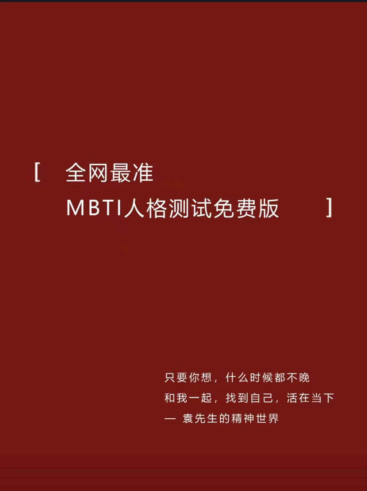
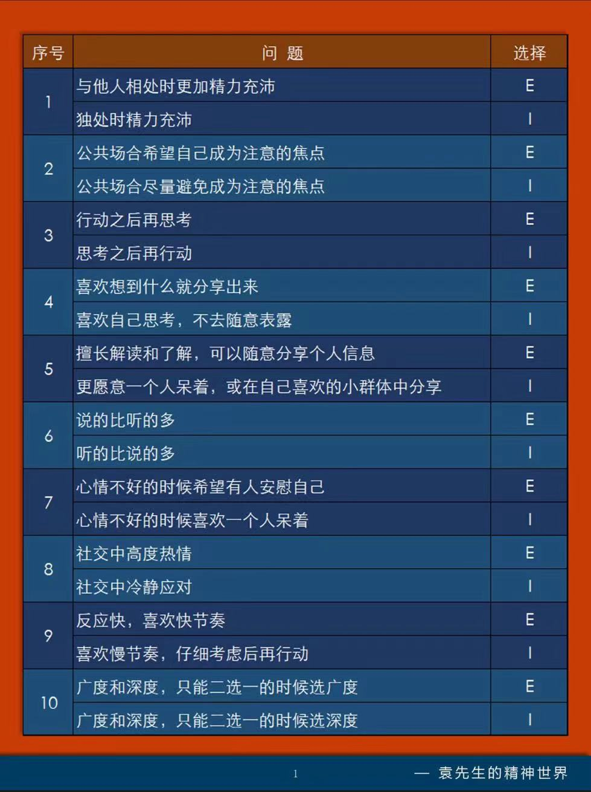
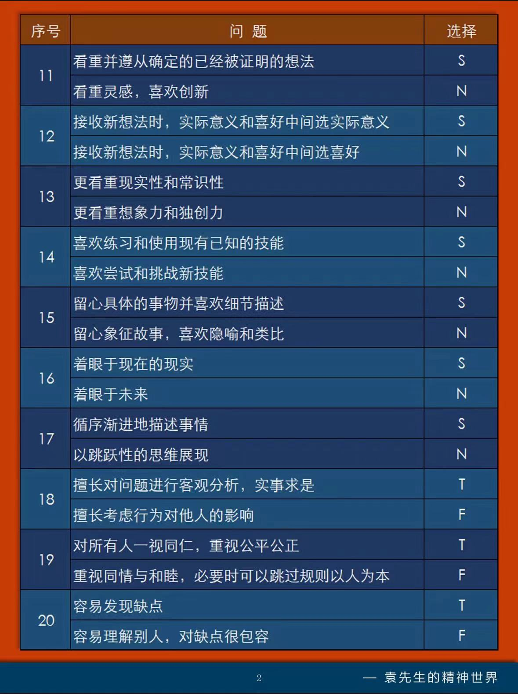
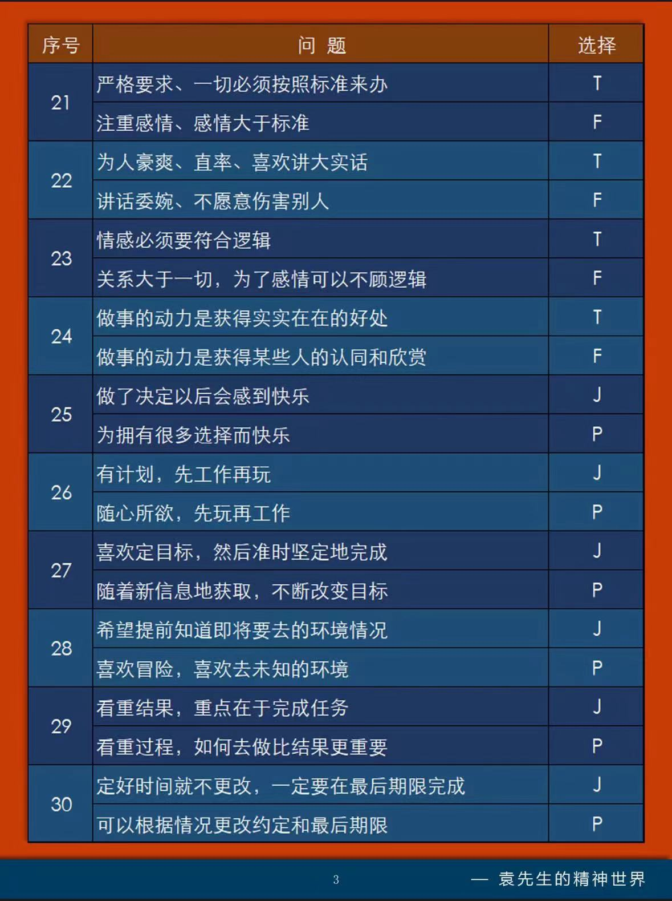
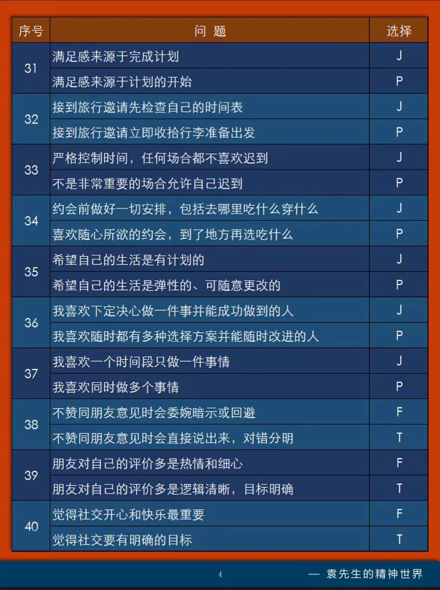
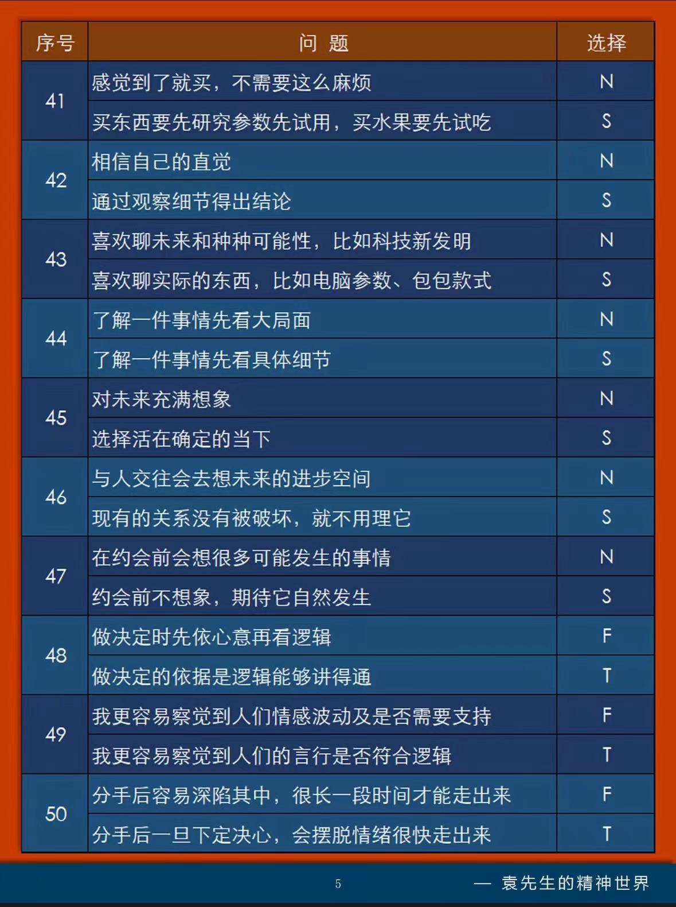
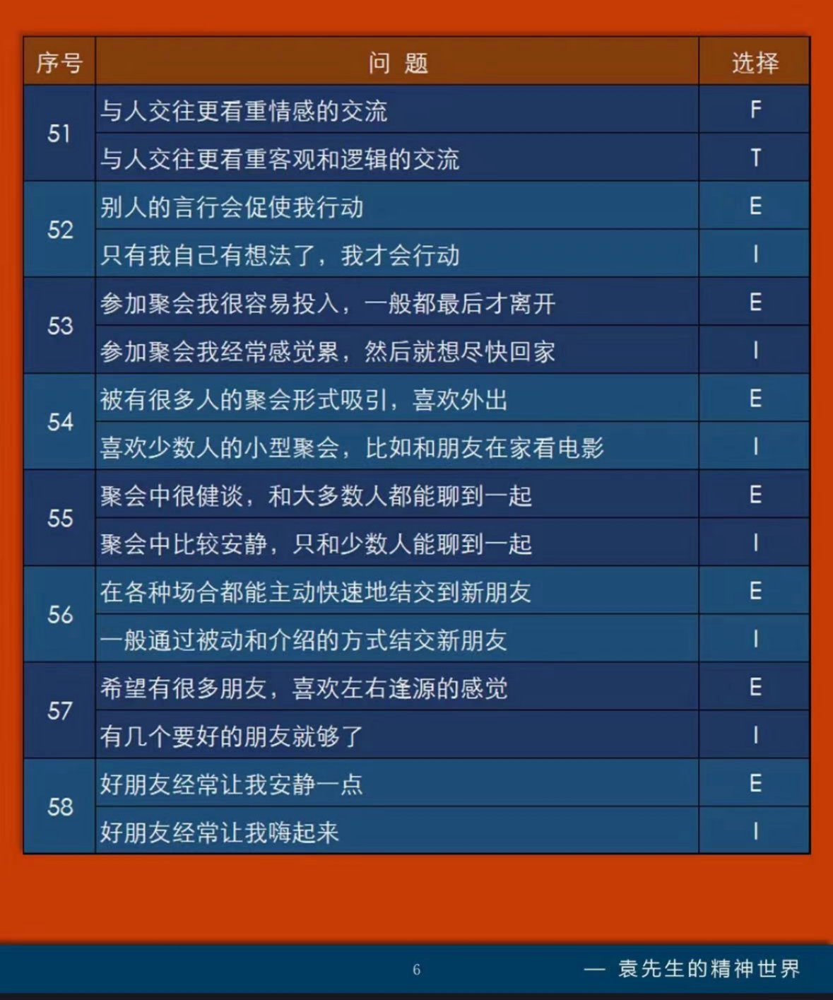

## 英语

- 扇贝单词
- 百词斩
- https://1000h.org/
  - [Enjoy App](https://github.com/ZuodaoTech/everyone-can-use-english)


## 大模型

- [LLaMA Assistant for Mac](https://github.com/Vaibhavs10/llama-assistant)
- https://github.com/yolain/ComfyUI-Yolain-Workflows

- [一个适合学习、使用、自主扩展的RAG](https://github.com/yuntianhe2014/Easy-RAG)


## Blog

- [Database Startups](https://transactional.blog/blog/2024-database-startups)
- [go map](https://victoriametrics.com/blog/go-map/)
- [Eric Schmidt’s AI prophecy: The next two years will shock you](https://www.exponentialview.co/p/eric-schmidts-ai-prophecy)
- [A visual guide to k8s troubleshooting](https://learnk8s.io/troubleshooting-deployments)
- https://bento.me/idoubi
- [为什么程序员最应该学习的是运营与销售，而不是技术？](https://www.91wink.com/index.php/%e4%b8%ba%e4%bb%80%e4%b9%88%e7%a8%8b%e5%ba%8f%e5%91%98%e6%9c%80%e5%ba%94%e8%af%a5%e5%ad%a6%e4%b9%a0%e7%9a%84%e6%98%af%e8%bf%90%e8%90%a5%e4%b8%8e%e9%94%80%e5%94%ae%ef%bc%8c%e8%80%8c%e4%b8%8d%e6%98%af/)

- [RAG教程](https://github.com/NirDiamant/RAG_Techniques)

- [软件工程师的工作除编码外，还有大量其他事务，比如总结文档、优化工具链等，作者将它们统称为“胶水工作”。胶水工作看似不起眼，但对于项目至关重要。本文指出了一个被忽视的事实：承担更多胶水工作的有责任心的人，反而更不易晋升；作者提供了一些建议。](https://noidea.dog/glue)
- [阮一峰-科技爱好者周刊（第 313 期）：如果新加坡没有空调](https://www.ruanyifeng.com/blog/2024/08/weekly-issue-313.html)

- https://ui.convertfa.st/

- [The Age of AI, Eric Schmidt ](https://github.com/ociubotaru/transcripts/blob/main/Stanford_ECON295%E2%A7%B8CS323_I_2024_I_The_Age_of_AI%2C_Eric_Schmidt.txt)
- [创业一年，人间三年](https://www.bilibili.com/read/cv37076357/?jump_opus=1)
  - https://mp.weixin.qq.com/s/rcOIUroaa7y2E5DkQtY88A

- https://www.caicai.me/


## 免费课程

- 𝐅𝐑𝐄𝐄 𝐃𝐞𝐯𝐎𝐩𝐬 & 𝐂𝐥𝐨𝐮𝐝 𝐂𝐞𝐫𝐭𝐢𝐟𝐢𝐜𝐚𝐭𝐢𝐨𝐧 𝐂𝐨𝐮𝐫𝐬𝐞𝐬:

  1. DevOps
  http://openclassrooms.com/courses/7853556-discover-the-devops-methodology

  2. CI/CD
  http://simplilearn.com/free-ci-cd-online-training-course-skillup

  3. Docker
  http://cognitiveclass.ai/courses/docker-essentials

  4. Kubernetes
  http://simplilearn.com/learn-kubernetes-basics-free-course-skillup

  5. GIT
  http://simplilearn.com/learn-git-basics-skillup

  6. GitHub
  http://mygreatlearning.com/academy/learn-for-free/courses/github-tutorial-for-beginners

  7. Linux
  http://mygreatlearning.com/academy/learn-for-free/courses/linux-tutorial

  8. Cloud Computing
  http://cognitiveclass.ai/courses/introduction-to-cloud

  9. AWS
  http://openclassrooms.com/courses/7864796-discover-cloud-with-amazon-web-services

  10. Azure
  http://mygreatlearning.com/academy/learn-for-free/courses/microsoft-azure-essentials

  11. AWS
  http://openclassrooms.com/courses/7864796-discover-cloud-with-amazon-web-services

  12. Azure
  http://mygreatlearning.com/academy/learn-for-free/courses/microsoft-azure-essentials

  13. Cloud Computing
  http://cognitiveclass.ai/courses/introduction-to-cloud

  14. Linux
  http://mygreatlearning.com/academy/learn-for-free/courses/linux-tutorial

  15. GCP
  http://simplilearn.com/learn-google-cloud-platform-fundamentals-free-course-skillup

  16. Serverless
  http://mygreatlearning.com/academy/learn-for-free/courses/serverless-computing

  17. Docker
  https://cognitiveclass.ai/courses/docker-essentials

  18. Kubernetes
  http://simplilearn.com/learn-kubernetes-basics-free-course-skillup

  19. CI/CD
  http://simplilearn.com/free-ci-cd-online-training-course-skillup

  20. Jenkins
  http://mygreatlearning.com/academy/learn-for-free/courses/jenkins-tutorial

  21. Puppet
  http://simplilearn.com/free-course-to-learn-puppet-basics-skillup…

  22. Chef
  http://simplilearn.com/chef-in-devops-basics-free-course-skillup

  23. Ansible
  http://simplilearn.com/learn-ansible-basics-free-course-skillup

  24. Selenium
  http://mygreatlearning.com/academy/learn-for-free/courses/selenium-basics

  25. VirtualBox & vSphere
  https://openclassrooms.com/en/courses/7163136-set-up-virtual-machines-using-virtualbox-and-vsphere

- 结对编程：https://github.com/entropy-research/Devon
- 微软的AI新手课程：https://github.com/microsoft/generative-ai-for-beginners
- https://digitaldefynd.com/
- https://www.classcentral.com/
- https://www.theodinproject.com/
- https://www.openculture.com/
- https://alison.com/
- https://www.mygreatlearning.com/
- https://www.real.discount/
- https://www.freecodecamp.org/

- [prompt-engineering](https://platform.openai.com/docs/guides/prompt-engineering)


## Design

- https://www.howtodesignbetter.com/


## 论文

- An explanation of prompt caching from the paper
  - https://arxiv.org/abs/2311.04934


## 工具

- [SQLFlow - a great tool to visualize SQL queries](https://sqlflow.gudusoft.com/)

- [MixTeX multimodal LaTeX, ZhEn, and, Table OCR. It performs efficient CPU-based inference in a local offline on Windows.](https://github.com/RQLuo/MixTeX-Latex-OCR)
- [一款个人数据抓取工具：Surfer-Data](https://github.com/CEREBRUS-MAXIMUS/Surfer-Data)

- [sentry 的平替了 gitchtip](https://glitchtip.com/documentation/install)
- [**一款图像分割模型：BiRefNet，可以从高分辨率图片中识别出目标物体**](https://github.com/ZhengPeng7/BiRefNet)

- [美丽的壁纸网站](https://www.color4bg.com/en/)

- [ 一个给文字添加高亮效果的tailwindcss 的插件](https://github.com/jln13x/tailwindcss-highlights)

- 图标

  - 推荐几个图标网站：
    1. 大部分的app图标在这里 https://pushkeen.ai/appstore-icons/51794
    2. 大部分的商标、公司logo在这里，例如阿里、intel、apple  https://fey.com/marketing/logos
    3. 可爱风格编程相关的图标在这里：https://github.com/SAWARATSUKI/KawaiiLogos

- 一个语音到语音转换系统：speech-to-speech

  支持将一种语言的语音转换为另一种语言语音，该项目使用GPT4-o作为语言模型，整合了语音活动检测 (VAD)、语音转文字 (STT)、、文字转语音 (TTS) 等模块，实现了完整的语音交互流程

  - https://github.com/eustlb/speech-to-speech

- [FIClash](https://github.com/chen08209/FlClash)

- [制作个人资料图片](https://pfpmaker.com/)

- [markdown 转幻灯片工具](https://github.com/BMPixel/moffee)

- [Semantic Search on Wikipedia](https://wikipedia-semantic-search.vercel.app/)

  - https://github.com/upstash/wikipedia-semantic-search

- [这段 50 行代码的「正则表达式」几乎可以完成任何复杂度文本内容的 RAG Chunking](https://gist.github.com/hanxiao/3f60354cf6dc5ac698bc9154163b4e6a)		

```javascript
// Updated: Aug. 15, 2024
// Run: node testRegex.js testText.txt
// Used in https://jina.ai/tokenizer
const fs = require('fs');
const util = require('util');

// Define variables for magic numbers
const MAX_HEADING_LENGTH = 7;
const MAX_HEADING_CONTENT_LENGTH = 200;
const MAX_HEADING_UNDERLINE_LENGTH = 200;
const MAX_HTML_HEADING_ATTRIBUTES_LENGTH = 100;
const MAX_LIST_ITEM_LENGTH = 200;
const MAX_NESTED_LIST_ITEMS = 6;
const MAX_LIST_INDENT_SPACES = 7;
const MAX_BLOCKQUOTE_LINE_LENGTH = 200;
const MAX_BLOCKQUOTE_LINES = 15;
const MAX_CODE_BLOCK_LENGTH = 1500;
const MAX_CODE_LANGUAGE_LENGTH = 20;
const MAX_INDENTED_CODE_LINES = 20;
const MAX_TABLE_CELL_LENGTH = 200;
const MAX_TABLE_ROWS = 20;
const MAX_HTML_TABLE_LENGTH = 2000;
const MIN_HORIZONTAL_RULE_LENGTH = 3;
const MAX_SENTENCE_LENGTH = 400;
const MAX_QUOTED_TEXT_LENGTH = 300;
const MAX_PARENTHETICAL_CONTENT_LENGTH = 200;
const MAX_NESTED_PARENTHESES = 5;
const MAX_MATH_INLINE_LENGTH = 100;
const MAX_MATH_BLOCK_LENGTH = 500;
const MAX_PARAGRAPH_LENGTH = 1000;
const MAX_STANDALONE_LINE_LENGTH = 800;
const MAX_HTML_TAG_ATTRIBUTES_LENGTH = 100;
const MAX_HTML_TAG_CONTENT_LENGTH = 1000;
const LOOKAHEAD_RANGE = 100;  // Number of characters to look ahead for a sentence boundary

// Define the regex pattern
// Headings
// Citations
// List items
// Block quotes
// Code blocks
// Tables
// Horizontal rules
// Standalone lines or phrases
// Sentences or phrases
// Quoted text, parenthetical phrases, or bracketed content
// Paragraphs
// HTML-like tags and their content
// LaTeX-style math expressions
// Fallback for any remaining content
// Read the regex and test text from files

const chunkRegex = new RegExp(
    "(" +
    // 1. Headings (Setext-style, Markdown, and HTML-style, with length constraints)
    `(?:^(?:[#*=-]{1,${MAX_HEADING_LENGTH}}|\\w[^\\r\\n]{0,${MAX_HEADING_CONTENT_LENGTH}}\\r?\\n[-=]{2,${MAX_HEADING_UNDERLINE_LENGTH}}|<h[1-6][^>]{0,${MAX_HTML_HEADING_ATTRIBUTES_LENGTH}}>)[^\\r\\n]{1,${MAX_HEADING_CONTENT_LENGTH}}(?:</h[1-6]>)?(?:\\r?\\n|$))` +
    "|" +
    // New pattern for citations
    `(?:\\[[0-9]+\\][^\\r\\n]{1,${MAX_STANDALONE_LINE_LENGTH}})` +
    "|" +
    // 2. List items (bulleted, numbered, lettered, or task lists, including nested, up to three levels, with length constraints)
    `(?:(?:^|\\r?\\n)[ \\t]{0,3}(?:[-*+•]|\\d{1,3}\\.\\w\\.|\\[[ xX]\\])[ \\t]+(?:(?:\\b[^\\r\\n]{1,${MAX_LIST_ITEM_LENGTH}}\\b(?:[.!?…]|\\.{3}|[\\u2026\\u2047-\\u2049]|[\\p{Emoji_Presentation}\\p{Extended_Pictographic}])(?=\\s|$))|(?:\\b[^\\r\\n]{1,${MAX_LIST_ITEM_LENGTH}}\\b(?=[\\r\\n]|$))|(?:\\b[^\\r\\n]{1,${MAX_LIST_ITEM_LENGTH}}\\b(?=[.!?…]|\\.{3}|[\\u2026\\u2047-\\u2049]|[\\p{Emoji_Presentation}\\p{Extended_Pictographic}])(?:.{1,${LOOKAHEAD_RANGE}}(?:[.!?…]|\\.{3}|[\\u2026\\u2047-\\u2049]|[\\p{Emoji_Presentation}\\p{Extended_Pictographic}])(?=\\s|$))?))` +
    `(?:(?:\\r?\\n[ \\t]{2,5}(?:[-*+•]|\\d{1,3}\\.\\w\\.|\\[[ xX]\\])[ \\t]+(?:(?:\\b[^\\r\\n]{1,${MAX_LIST_ITEM_LENGTH}}\\b(?:[.!?…]|\\.{3}|[\\u2026\\u2047-\\u2049]|[\\p{Emoji_Presentation}\\p{Extended_Pictographic}])(?=\\s|$))|(?:\\b[^\\r\\n]{1,${MAX_LIST_ITEM_LENGTH}}\\b(?=[\\r\\n]|$))|(?:\\b[^\\r\\n]{1,${MAX_LIST_ITEM_LENGTH}}\\b(?=[.!?…]|\\.{3}|[\\u2026\\u2047-\\u2049]|[\\p{Emoji_Presentation}\\p{Extended_Pictographic}])(?:.{1,${LOOKAHEAD_RANGE}}(?:[.!?…]|\\.{3}|[\\u2026\\u2047-\\u2049]|[\\p{Emoji_Presentation}\\p{Extended_Pictographic}])(?=\\s|$))?)))` +
    `{0,${MAX_NESTED_LIST_ITEMS}}(?:\\r?\\n[ \\t]{4,${MAX_LIST_INDENT_SPACES}}(?:[-*+•]|\\d{1,3}\\.\\w\\.|\\[[ xX]\\])[ \\t]+(?:(?:\\b[^\\r\\n]{1,${MAX_LIST_ITEM_LENGTH}}\\b(?:[.!?…]|\\.{3}|[\\u2026\\u2047-\\u2049]|[\\p{Emoji_Presentation}\\p{Extended_Pictographic}])(?=\\s|$))|(?:\\b[^\\r\\n]{1,${MAX_LIST_ITEM_LENGTH}}\\b(?=[\\r\\n]|$))|(?:\\b[^\\r\\n]{1,${MAX_LIST_ITEM_LENGTH}}\\b(?=[.!?…]|\\.{3}|[\\u2026\\u2047-\\u2049]|[\\p{Emoji_Presentation}\\p{Extended_Pictographic}])(?:.{1,${LOOKAHEAD_RANGE}}(?:[.!?…]|\\.{3}|[\\u2026\\u2047-\\u2049]|[\\p{Emoji_Presentation}\\p{Extended_Pictographic}])(?=\\s|$))?)))` +
    `{0,${MAX_NESTED_LIST_ITEMS}})?)` +
    "|" +
    // 3. Block quotes (including nested quotes and citations, up to three levels, with length constraints)
    `(?:(?:^>(?:>|\\s{2,}){0,2}(?:(?:\\b[^\\r\\n]{0,${MAX_BLOCKQUOTE_LINE_LENGTH}}\\b(?:[.!?…]|\\.{3}|[\\u2026\\u2047-\\u2049]|[\\p{Emoji_Presentation}\\p{Extended_Pictographic}])(?=\\s|$))|(?:\\b[^\\r\\n]{0,${MAX_BLOCKQUOTE_LINE_LENGTH}}\\b(?=[\\r\\n]|$))|(?:\\b[^\\r\\n]{0,${MAX_BLOCKQUOTE_LINE_LENGTH}}\\b(?=[.!?…]|\\.{3}|[\\u2026\\u2047-\\u2049]|[\\p{Emoji_Presentation}\\p{Extended_Pictographic}])(?:.{1,${LOOKAHEAD_RANGE}}(?:[.!?…]|\\.{3}|[\\u2026\\u2047-\\u2049]|[\\p{Emoji_Presentation}\\p{Extended_Pictographic}])(?=\\s|$))?))\\r?\\n?){1,${MAX_BLOCKQUOTE_LINES}})` +
    "|" +
    // 4. Code blocks (fenced, indented, or HTML pre/code tags, with length constraints)
    `(?:(?:^|\\r?\\n)(?:\`\`\`|~~~)(?:\\w{0,${MAX_CODE_LANGUAGE_LENGTH}})?\\r?\\n[\\s\\S]{0,${MAX_CODE_BLOCK_LENGTH}}?(?:\`\`\`|~~~)\\r?\\n?` +
    `|(?:(?:^|\\r?\\n)(?: {4}|\\t)[^\\r\\n]{0,${MAX_LIST_ITEM_LENGTH}}(?:\\r?\\n(?: {4}|\\t)[^\\r\\n]{0,${MAX_LIST_ITEM_LENGTH}}){0,${MAX_INDENTED_CODE_LINES}}\\r?\\n?)` +
    `|(?:<pre>(?:<code>)?[\\s\\S]{0,${MAX_CODE_BLOCK_LENGTH}}?(?:</code>)?</pre>))` +
    "|" +
    // 5. Tables (Markdown, grid tables, and HTML tables, with length constraints)
    `(?:(?:^|\\r?\\n)(?:\\|[^\\r\\n]{0,${MAX_TABLE_CELL_LENGTH}}\\|(?:\\r?\\n\\|[-:]{1,${MAX_TABLE_CELL_LENGTH}}\\|){0,1}(?:\\r?\\n\\|[^\\r\\n]{0,${MAX_TABLE_CELL_LENGTH}}\\|){0,${MAX_TABLE_ROWS}}` +
    `|<table>[\\s\\S]{0,${MAX_HTML_TABLE_LENGTH}}?</table>))` +
    "|" +
    // 6. Horizontal rules (Markdown and HTML hr tag)
    `(?:^(?:[-*_]){${MIN_HORIZONTAL_RULE_LENGTH},}\\s*$|<hr\\s*/?>)` +
    "|" +
    // 10. Standalone lines or phrases (including single-line blocks and HTML elements, with length constraints)
    `(?:^(?:<[a-zA-Z][^>]{0,${MAX_HTML_TAG_ATTRIBUTES_LENGTH}}>)?(?:(?:[^\\r\\n]{1,${MAX_STANDALONE_LINE_LENGTH}}(?:[.!?…]|\\.\\.\\.|[\\u2026\\u2047-\\u2049]|[\\p{Emoji_Presentation}\\p{Extended_Pictographic}])(?=\\s|$))|(?:[^\\r\\n]{1,${MAX_STANDALONE_LINE_LENGTH}}(?=[\\r\\n]|$))|(?:[^\\r\\n]{1,${MAX_STANDALONE_LINE_LENGTH}}(?=[.!?…]|\\.\\.\\.|[\\u2026\\u2047-\\u2049]|[\\p{Emoji_Presentation}\\p{Extended_Pictographic}])(?:.{1,${LOOKAHEAD_RANGE}}(?:[.!?…]|\\.\\.\\.|[\\u2026\\u2047-\\u2049]|[\\p{Emoji_Presentation}\\p{Extended_Pictographic}])(?=\\s|$))?))(?:</[a-zA-Z]+>)?(?:\\r?\\n|$))` +
    "|" +
    // 7. Sentences or phrases ending with punctuation (including ellipsis and Unicode punctuation)
    `(?:(?:[^\\r\\n]{1,${MAX_SENTENCE_LENGTH}}(?:[.!?…]|\\.\\.\\.|[\\u2026\\u2047-\\u2049]|[\\p{Emoji_Presentation}\\p{Extended_Pictographic}])(?=\\s|$))|(?:[^\\r\\n]{1,${MAX_SENTENCE_LENGTH}}(?=[\\r\\n]|$))|(?:[^\\r\\n]{1,${MAX_SENTENCE_LENGTH}}(?=[.!?…]|\\.\\.\\.|[\\u2026\\u2047-\\u2049]|[\\p{Emoji_Presentation}\\p{Extended_Pictographic}])(?:.{1,${LOOKAHEAD_RANGE}}(?:[.!?…]|\\.\\.\\.|[\\u2026\\u2047-\\u2049]|[\\p{Emoji_Presentation}\\p{Extended_Pictographic}])(?=\\s|$))?))` +
    "|" +
    // 8. Quoted text, parenthetical phrases, or bracketed content (with length constraints)
    "(?:" +
    `(?<!\\w)\"\"\"[^\"]{0,${MAX_QUOTED_TEXT_LENGTH}}\"\"\"(?!\\w)` +
    `|(?<!\\w)(?:['\"\`'"])[^\\r\\n]{0,${MAX_QUOTED_TEXT_LENGTH}}\\1(?!\\w)` +
    `|\\([^\\r\\n()]{0,${MAX_PARENTHETICAL_CONTENT_LENGTH}}(?:\\([^\\r\\n()]{0,${MAX_PARENTHETICAL_CONTENT_LENGTH}}\\)[^\\r\\n()]{0,${MAX_PARENTHETICAL_CONTENT_LENGTH}}){0,${MAX_NESTED_PARENTHESES}}\\)` +
    `|\\[[^\\r\\n\\[\\]]{0,${MAX_PARENTHETICAL_CONTENT_LENGTH}}(?:\\[[^\\r\\n\\[\\]]{0,${MAX_PARENTHETICAL_CONTENT_LENGTH}}\\][^\\r\\n\\[\\]]{0,${MAX_PARENTHETICAL_CONTENT_LENGTH}}){0,${MAX_NESTED_PARENTHESES}}\\]` +
    `|\\$[^\\r\\n$]{0,${MAX_MATH_INLINE_LENGTH}}\\$` +
    `|\`[^\`\\r\\n]{0,${MAX_MATH_INLINE_LENGTH}}\`` +
    ")" +
    "|" +
    // 9. Paragraphs (with length constraints)
    `(?:(?:^|\\r?\\n\\r?\\n)(?:<p>)?(?:(?:[^\\r\\n]{1,${MAX_PARAGRAPH_LENGTH}}(?:[.!?…]|\\.{3}|[\\u2026\\u2047-\\u2049]|[\\p{Emoji_Presentation}\\p{Extended_Pictographic}])(?=\\s|$))|(?:[^\\r\\n]{1,${MAX_PARAGRAPH_LENGTH}}(?=[\\r\\n]|$))|(?:[^\\r\\n]{1,${MAX_PARAGRAPH_LENGTH}}(?=[.!?…]|\\.{3}|[\\u2026\\u2047-\\u2049]|[\\p{Emoji_Presentation}\\p{Extended_Pictographic}])(?:.{1,${LOOKAHEAD_RANGE}}(?:[.!?…]|\\.{3}|[\\u2026\\u2047-\\u2049]|[\\p{Emoji_Presentation}\\p{Extended_Pictographic}])(?=\\s|$))?))(?:</p>)?(?=\\r?\\n\\r?\\n|$))` +
    "|" +
    // 11. HTML-like tags and their content (including self-closing tags and attributes, with length constraints)
    `(?:<[a-zA-Z][^>]{0,${MAX_HTML_TAG_ATTRIBUTES_LENGTH}}(?:>[\\s\\S]{0,${MAX_HTML_TAG_CONTENT_LENGTH}}?</[a-zA-Z]+>|\\s*/>))` +
    "|" +
    // 12. LaTeX-style math expressions (inline and block, with length constraints)
    `(?:(?:\\$\\$[\\s\\S]{0,${MAX_MATH_BLOCK_LENGTH}}?\\$\\$)|(?:\\$[^\\$\\r\\n]{0,${MAX_MATH_INLINE_LENGTH}}\\$))` +
    "|" +
    // 14. Fallback for any remaining content (with length constraints)
    `(?:(?:[^\\r\\n]{1,${MAX_STANDALONE_LINE_LENGTH}}(?:[.!?…]|\\.{3}|[\\u2026\\u2047-\\u2049]|[\\p{Emoji_Presentation}\\p{Extended_Pictographic}])(?=\\s|$))|(?:[^\\r\\n]{1,${MAX_STANDALONE_LINE_LENGTH}}(?=[\\r\\n]|$))|(?:[^\\r\\n]{1,${MAX_STANDALONE_LINE_LENGTH}}(?=[.!?…]|\\.{3}|[\\u2026\\u2047-\\u2049]|[\\p{Emoji_Presentation}\\p{Extended_Pictographic}])(?:.{1,${LOOKAHEAD_RANGE}}(?:[.!?…]|\\.{3}|[\\u2026\\u2047-\\u2049]|[\\p{Emoji_Presentation}\\p{Extended_Pictographic}])(?=\\s|$))?))` +
    ")",
    "gmu"
);

// read from the arg[1] file
const testText = fs.readFileSync(process.argv[2], 'utf8');

// Function to format bytes to a human-readable string
function formatBytes(bytes) {
    if (bytes < 1024) return bytes + " bytes";
    else if (bytes < 1048576) return (bytes / 1024).toFixed(2) + " KB";
    else if (bytes < 1073741824) return (bytes / 1048576).toFixed(2) + " MB";
    else return (bytes / 1073741824).toFixed(2) + " GB";
}

// Start measuring time and memory
const startTime = process.hrtime();
const startMemory = process.memoryUsage().heapUsed;

// Apply the regex
const matches = testText.match(chunkRegex);

// End measuring time and memory
const endTime = process.hrtime(startTime);
const endMemory = process.memoryUsage().heapUsed;

// Calculate execution time and memory usage
const executionTime = endTime[0] + endTime[1] / 1e9;
const memoryUsed = endMemory - startMemory;

// Output results
console.log(`Number of chunks: ${matches ? matches.length : 0}`);
console.log(`Execution time: ${executionTime.toFixed(3)} seconds`);
console.log(`Memory used: ${formatBytes(memoryUsed)}`);

// Output the first 5 matches (or fewer if there are less than 5)
console.log('\nFirst 10 chunks:');
if (matches) {
    matches.slice(0, 100).forEach((match, index) => {
        console.log(util.inspect(match, {maxStringLength: 50}));
    });
} else {
    console.log('No chunks found.');
}

// Output regex flags
console.log(`\nRegex flags: ${chunkRegex.flags}`);

// Check for potential issues
if (executionTime > 5) {
    console.warn('\nWarning: Execution time exceeded 5 seconds. The regex might be too complex or the input too large.');
}
if (memoryUsed > 100 * 1024 * 1024) {
    console.warn('\nWarning: Memory usage exceeded 100 MB. Consider processing the input in smaller chunks.');
}
```


## 书籍

- Web Application Hacker’s Handbook
  The Hackers Playbook 2
  Hacking: The Art of Exploitation
  Ghost in the Wires
  Social Engineering: The Art of Human Hacking 
  Computer Hacking Beginners Guide
  Kali Linux Revealed : Mastering Pen Testing Distribution 
  The Basics of Hacking and Penetration Testing 
  Nmap Network Scanning 
  Practical Malware Analysis: The Hands-on Guide
  RTFM: Red Team Field Manual 
  Hash Crack: Password Cracking 
  Mastering Metaspoilt 
  Advanced Penetration Testing 
  Hacking: A Beginners Guide to Your First Computer Hack
  CISSP All in One Exam Guide
  Web Hacking 101
  Blue Team Handbook: Incident Response Edition 
  Black Hat Python: Python 
  Gray Hat Hacking: The Ethical Hacker’s Handbook
  - 以上书籍下载源
    - PDF Drive 
    - Heimdal Security 
    - CollegeLearners 
    - Endureka 
    - Freetechbooks
    - Simplilearn

- Go 语言编程之旅

- 重组与突破

- [Software Engineering at Google 中文版](https://qiangmzsx.github.io/Software-Engineering-at-Google/#/)

- 英汉数学全书

- 纳瓦尔宝典
- Zero to Sold
- Rework
- The Minimalist Entrepreneur
- Make
- Company of One

- 智能时代

- 笔记的方法
  - 组织知识的九种结构
    - 树状分类
    - 因果解释
    - 描述
    - 时间轴
    - 论点/案例
    - 内容结构
    - 故事
    - 流程与顺序
    - 关系
- 

## 好玩儿

- 把 YouTube 当成电视看。非常好
  - https://ytch.xyz/

- MBTI人格测试

  - 测试方法：

    - 准备一张白纸，在第一排依次写下4个维度中的8个字母：E I、S-N、T-F、J-P

    - 依次做图中的选择题

    - 每做一个选择，就在自己选择的字母下面用“正”字法计数

    - 最后选取4个维度中选择次数多的那个字母，组合起来就是你的性格类型

    - 八个字母中 选出属于自己的四个，组成自己的性格特征！

      - 外向E---内向I 
      - 感觉S---直觉N 
      - 思维T---情感F 
      - 判断J---知觉P

      

      

      

      

      

      

      

- 一个既能快速学习知识，又能提高英语水平的学习方法，

  即费曼学习+英文解释+刻意练习

  1.将你要学习的PDF上传到GPT或者claude
  2.告诉AI你用费曼学习+英文解释的方法帮助你理解这篇材料。
  3.向AI提问，让他用英文出问题考你。
  4.关键：自己用英文默念回答一遍，如果回答不上来，再去学习相关概念，直到用英文能把概念解释得很清楚。

  费曼学习的核心就是：当你能给人解释清楚一个概念时，才算完全理解。而你能用英文解释清楚时，代表你能用母语人的思维方式去解释一个复杂概念，这个过程中你需要对你的英语表达方式进行整合，并且用口语输出，这个过程很慢，但对你英语有巨大提升。

  5.让AI纠正你的问题。这是《刻意练习》的核心概念：通过正确答案的反馈，有目的的纠正自己的理解，语法，表达，词汇，从而让你大脑走出舒适区。建立新的心理表征。

  这个过程很痛苦，但是同时学习知识和英文效率很高的方式。

- [全球著名艺术油画](https://artvee.com/)