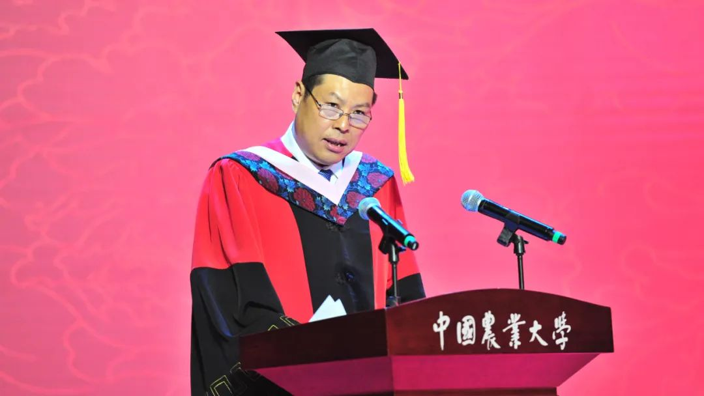
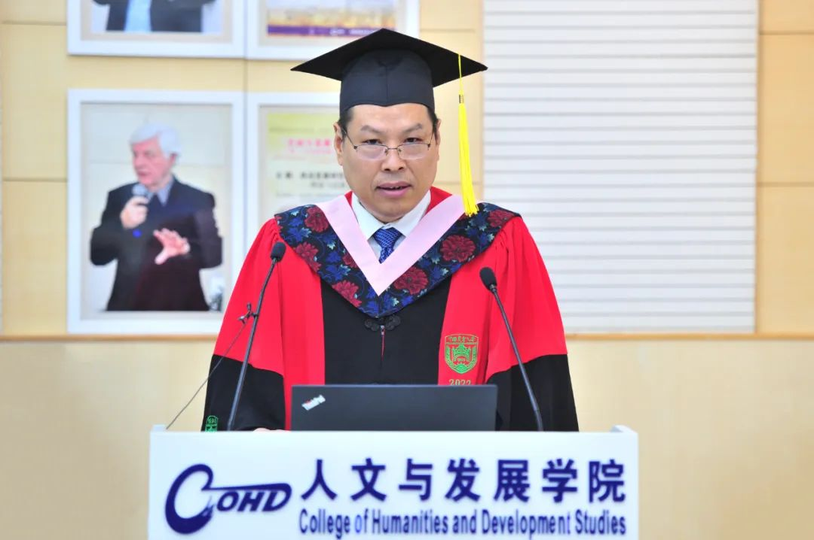
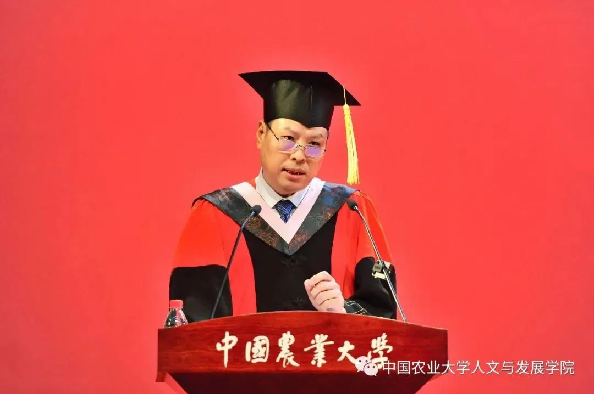
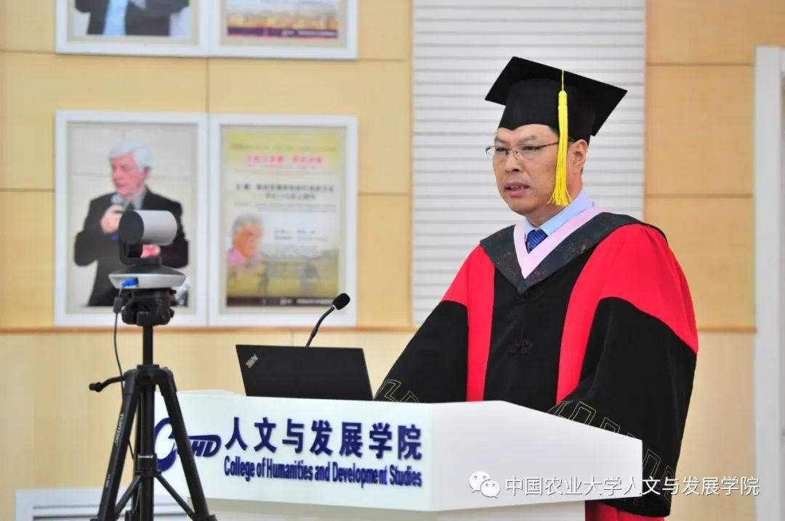
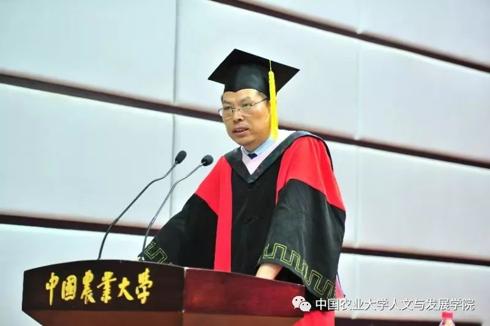
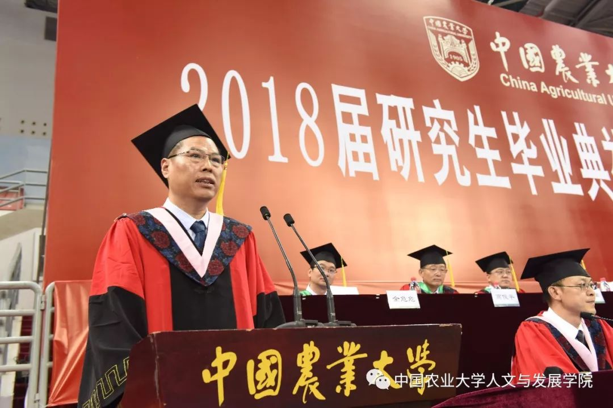

# 叶敬忠院长演讲

## 2023 在权力的包围中不要熄灭真善美的光

各位同学：

大家好！

祝贺大家毕业！不知这些年你们的学习是否顺利、生活是否愉快，但能毕业就好！

前几天，清华大学的一位教授在朋友圈里说，一到毕业季，大学的毕业讲演就开始了：有的循循善诱，有的春风化雨，但经常是把自己做不到的事情都叮嘱给毕业生。我深以为然。但又能怎样？虽然未能做到，但至少没有熄灭眼里的光，**因为学生正是老师眼里的光。**

本以为今年不会再作为院长做毕业致辞，也曾感到一丝解脱。因为我的讲话无非是基于当下的时代，向同学们做些叮嘱，**而面对时代并与之较真，常常需要有扛着痛苦的勇气。**

**作为中国人，我们为国家保持长期的稳定发展以及取得的巨大成就而感到骄傲和自豪。**但是，从世界范围来看，这个时代正在发生的一些事情，让我每天醒来都恍若隔世。战争灾难、凶残杀害、欺辱霸凌、网络暴力……知名学者煽动鼓噪狭隘民族主义，主流媒体情有独钟娱乐花边新闻，公共部门系统编造虚假统计数据……，等等，等等！

我从来没想到在21世纪的文明社会里还会发生这么多的事情。一百七十五年前，马克思曾感慨道，**“一切坚固的东西都烟消云散了，一切神圣的东西都被亵渎了”**。今天，我们需要再次用冷静的眼光看待我们的处境，需要再次面对一百零五年前梁漱溟之父梁济因迷茫未来而投湖殉清的生死之问：**“这个世界会好吗？”**

**从世界范围来看，我每每感到“三观”被打破，底线被击穿，想象力严重赤字。我对“明天会更好”极其怀疑，对“文明的进程”极度不确定。**我们时常忙碌在各种无可奈何的工作中，除了满心疲惫外，常常感受不到存在的意义是什么。我的一位同事曾说，以前一般到周五才会感到疲累，而现在到周三就开始倦乏，且不知道为什么会如此。

同学们，这或许就是你们即将穿行的世间。请不要怪我在毕业之际不去对未来做一番令人亢奋的憧憬，其实你们也不缺少这个。

在此时代，我想叮嘱大家“保持底线”，因为人类行为正在不断击穿底线；我想叮嘱大家“回归常识”，因为人类行动常常违背常识；我想叮嘱大家“真实做人”，因为人类交往每每是合作表演；我想叮嘱大家“高雅做事”，因为人类活动往往是江湖共谋；我想叮嘱大家“把人当人”，因为人类发展已经将一个个鲜活的人看作一个个数字；我想叮嘱大家“记住创伤”，因为人类会在亢奋中轻易忘却曾经经历的苦难。

但是，**我今天更想叮嘱大家：“在权力的包围中保持清醒！”**

同学们，在你们离开校园进入社会之后，你们将立刻感受到权力的无处不在，甚至无所不能。

无论你们是单位领导还是普通员工，只要工作岗位与人相关，就拥有了某种权力；无论你们从事什么工作，哪怕是灵活就业，甚或不从事任何工作，只要与公共部门或他人打交道，就必然要面对各种权力。因此，你们会更加深刻地感受到自己身处权力的包围之中。

**我很担心，你们会在权力的包围中“入乡随俗”，渐渐地迷恋上权力，迷失了自我，迷茫了人生。**

**权力确实有着巨大的吸引力，可以让人迷恋上瘾，从而变得“精致”圆滑。**多年前，有一位大学生返乡，由于其母是地方领导，因此自他下火车开始，便有各种妥帖的安排，从食宿到出行，无微不至，其间还伴随着各种赞许和捧场。那时我的第一感受并不是排斥，而是觉得，或许每个人都有可能对如此周密的安排上瘾，也都会迷恋上这种无处不在的优越感。还有一次，某著名高校的一位教授曾兴奋地言说他到地方调研，该地领导亲自接待，其一腔一势无不流露出对这种优越感的无比陶醉。

正因如此，**有些人在不经意间开始迎合权力，追逐权力。在权力面前，他们惯用一套左右逢源、精致圆顺的“话术”，“见什么人说什么话，在什么场合说什么话”。**乍听起来，会觉得别人怎么“那么懂事、那么会说话”，但仔细一想，总感觉不那么真实，不像是其本真的话语。

**权力确实有着巨大的支配力，可以让人变得傲慢任性，从而迷失自我。**权力系统的一个动作就可以让收割机在高速公路上排起长队，将绿水青山开垦成梯田泥石流，将昨日的“退耕还林”变为今日的“退林还耕”。权力总是被摆在显位并被推至高位。久而久之，一些人习惯了一切以自我为中心。某地举办学术会议时，年过花甲的老教授在烈日下排好站位，等候年轻的领导前来合影，一等就是近20分钟。更为严重的是，权力还可能制造出无所不能的幻象，因此在光天化日之下“强行变码”、“指鼠为鸭”。

正因如此，**有些人开始迷失自我，将拥有权力视作代表真理——即便是不经意间说出的一句话，也常常被合理化、合法化、操作化。**他们很难了解或感知权力可能给无数的普通人带去无奈感、无力感、无助感，以及由此产生不安感、挫折感、疏离感。

**权力确实有着巨大的规训力，可以让人变得机械刻板，从而麻木迷茫。**职场培训常常要求学生要学会“服从”，这虽然听起来刺耳，但不得不承认已经成为实践中的惯常做法。一位学生在南方某污染治理部门工作，每天制造海量的数据报表，唯一要求就是确保数据达标；一位学生在西部某督查部门工作，每天按照上级要求上报百分之百的村民扫码率，但很多村庄的村民甚至都没听说过扫码这件事；一位学生在东部某地负责食品安全督导工作，每次也只是在乡村超市前停留半分钟拍照，有了照片便是“尽职免责”。一些学生刚入职时强烈抱怨形式主义，但一个月之后，他们自己都承认慢慢习惯了形式主义。

正因如此，就如鱼儿每天在水里游来游去却不知水为何物一样，**当人们形成无意识的惯性后，便陷入不断加速的循环之中，无限地忙碌着，眼里只有制造出来的文件、数据、痕迹，而没有其背后活生生的人。**他们每天都在重复人类学家大卫·格雷伯所戏称的没有意义、不必要、甚至有害的“狗屁工作”，同时还要熬夜加班、假装热爱。

同学们，在权力的诱惑、支配和规训之下，其实每个人都很难独善其身。尽管如此，**我还是希望你们不要因为权力的吸引力而变得“精致”圆滑，不要因为权力的支配力而变得傲慢任性，也不要因为权力的规训力而变得麻木迷茫。**因为，你们永远都是老师眼里的那束光。

在我看来，**学生最大的特点就是简单、真实、干净。大家从小学开始就学习要求真、求善、求美。**在过去的毕业讲话中，我说要“在复杂的社会里守住纯真”，就是希望你们做事时求真；我说要“像弱者一样感受世界”，就是希望你们待人时求善；我说要“在理性的路上记住感性”，就是希望你们在对待世界、社会、自然和生活时求美。

同学们，**权力从本质上并无好坏之分，但权力的实践既可能带来说谎造假、使坏行恶、比丑摆烂，也可能实现诚信真实、积福行善、审美向上。**

**面对权力的包围，人们或许会因为眼中只有权力而忘掉人民，会因为权力无所不能而忘掉真理，会因为机械执行权力而忘掉背后的人和工作的意义。这样下去，尽管可以获得一些荣誉，但却缺乏美德；也许可以享受一些快活，但却缺乏幸福；或许可以拥有一些权威，但却缺乏尊重。**这样的世界并不真实，这样的社会难言善良，这样的人生并不美丽。我相信你们也是这样认为的。

**面对权力的包围，我不能要求你们像一枚鸡蛋撞向坚硬的高墙，但希望你们能够保留装在脆弱外壳里那颗真善美的灵魂；希望你们不要熄灭灵魂深处那束真善美的光；希望你们保持向着真善美的那束光自由奔跑的勇气，即便摔了一跤，也可以面带微笑。**你们的奔跑或许可以让更多人获得平等，让更多人享有自由，让更多人得到尊重。

同学们，在去年的学院教代会上，我结合担任8年院长的经历，分享了学院治理的感悟。我说，**学院权力的最高境界就是让师生感觉不到权力的存在。**中央要求，任何人行使权力都必须为人民服务，国家最大的权力就是为人民服务。我想，**只要不熄灭真善美的这束光，不泄掉自由奔跑的勇气，不丧失人类解放的信心，或许某天，人类可以被权力包围而感觉不到权力的存在。**我相信，那一定会是最优的权力、最美的世界、最好的社会。

同学们，这些年来，你们或许受了些委屈。因为在有些人看来，人文与发展学院和人文社会科学无足轻重，小白楼和民主楼也没有那么宏伟高大。但是，**我们把低矮的楼宇收拾得干净、亮堂、温馨，让每一位老师都感觉到放松、平静、和谐；我们让沉闷的课堂散发着思想、精神、价值，使每一位学生都感受到自由、平等、尊重。**

在你们即将离开学院之际，我希望你们，亲爱的同学们，**能够带着一股无法抗拒的力量，向社会表明人文与发展学院的理想，那就是：不让虚假蒙蔽真实，不让邪恶取代善良，不让丑陋压制美好！**

谢谢大家！

2023年6月21日

## 2022 在理性的路上记住感性

各位同学：

大家好！

祝贺大家顺利毕业！毕业意味着大家已经顺利完成学业、获得学位，意味着大家学到丰富的知识、掌握充分的技能，也意味着大家更加成熟、更加理性。在过去的几年中，大家为此付出了汗水和努力；对即将开启的人生新舞台，你们一定感到既激动又兴奋。

此时此刻，大家已经收到很多祝福，我更想送给大家的是一个提醒，那就是：**我们可能已经走得太远！**你们已经学到可以改变个人命运的知识，但是否还记得大学教育所追求的社会进步和人类解放的理想？你们已经掌握可以取得个人成功的技能，但是否还记得科学技术所担负的探索自然和造福大众的使命？你们已经习惯为了保持个人领先的竞争，但是否还记得人类竞争原本追求的根本不是超越他人、而是超越自我的目标？

也许有人会说，在当今的现实社会，这些理想、使命、目标都过于浪漫、过于遥远。其实，这恰恰说明了我们自己已经走得太远，而不是因为这些理想、使命、目标本身太远。是的，今天我们必须面对这样的现实，正如纪伯伦所言，“我们已经走得太远，以至于忘记了为什么而出发”。我还想再加上一句，那就是“以至于忘记了是从哪里出发的”。

在此方面，最突出的，莫过于对所谓的“理性”（即工具理性）的无限推崇。我深切地感受到，**人们在理性的路上已经走得太远太远。人们沉迷于让自己显得更为成熟的理性之中，却忘记了“人在变成理性生灵之前，先是感性生灵”，忘记了自然生灵在理性道路上所依赖的正是感性、感受、感情的发挥。**这普遍表现为，人们对世间苦难的无感和对人类遭遇的冷漠。

不是吗？**面对残忍狠毒的暴力殴打和不忍直视的欺侮凌辱，人们或袖手旁观或避之唯恐不及；面对疼痛难忍的临盆待产和刻不容缓的危重病患，人们或拒之门外或等待指令；面对流落街头的被困打工人和缺吃少喝的被困司机，人们或无暇顾及或照“章”办事；面对打工农民的返乡渴望和种地农民的下田劳动，人们或“恶意”相加或奉命阻拦。**

凡此种种，在高度“文明”的社会里时有发生。究其原因，无非是人们都习惯于“遇事要沉着冷静”，而不能“感情用事”。作为常规性的为人处世原则，这或许无可厚非。**但是，这种“沉着冷静”的背后其实并不是临危不惧和处变不惊，而是一种“多一事不如少一事”的明哲保身或自我利害得失的权衡算计。这种“沉着冷静”其实是一种内心城府，也是一种精神冷漠。**导致这一现象的根本原因，在我看来，就是人们在理性的路上走得太远。

一位知名的历史学者最近谈到，他过去对休谟名言“人的理性永远是情感的奴隶”体验不深，但近期经历让他认识到，感性和感受都非常重要。过去人们总是相信理性的力量，认为所有的愚昧都是因为缺乏理性，但现在他认识到，如果只有理性，如果知识都是来自书本学习而缺乏感触和体验，人的认识会很有限。因此，理性虽然重要，但只有理性又是远远不够的。

卢梭指出，**人类先于理性而存在的是人的天然本性或感性，其中最重要的便是怜悯，即人本能地不愿意目睹同类生灵受难和死亡。这是因为人类生灵都有感受力，即感受他人感受的能力。**例如，剧院里的观众常常为剧中不幸的人流下同情的眼泪。也就是说，**人类天生怜悯，本能地具有感受他人苦难、为受苦人设身处地着想的能力。这是纯天然的感情，是无须思考就有的力量，永远无法被堕落的品行摧垮。**正因怜悯，所以人能克制个体只考虑自我，也能促进人类互相保护，在见到同类遭受苦难时毫不犹豫地出手相助。

然而，“文明”社会随着人的理性的不断演进，却抑制了人的天然本性。理性使人更多考虑自我，导致了人类的各种痛苦和不幸、混乱和失范。**正是由于理性的思维，人们在见到同类受难时，常常暗自心想：“反正我是安全的”；在见到街头暴行时，只是捂住自己的耳朵、闭上自己的眼睛，只需稍微为自己辩解一下，便阻止了自己的怜悯心和感受力。**

当然，理性和感性的程度在任何社会都会因人而异。总的来说，**怜悯心和感受力在感性更强的人身上表现得朦胧而强烈，但在理性更强的人身上则表现得成熟但微弱。****因此，****面对街头暴行，谨慎的理性人往往站得远远的，那些挺身而出的，常常是卖菜大姐、快递小哥或流调中最辛苦的打工人。**

同学们，人类无论走多远，都要记住是从哪里出发的、为什么而出发。今天你们即将离开学院、远行四方，我用这些主要来自卢梭的稍显抽象而冗长的论述，就是想提醒大家，**在理性的路上一定要记住感性。尤其是，一定要保持感受他人感受的能力。**

未来，你可能从事社会发展、行政管理、教学研究等各类工作，也可能自主创业；你可能是一名领导、职员、行动者，也可能是自由职业者。但无论你从事什么职业，无论你身处什么岗位：

**请努力感受普通人面对刻板规定时的无奈感。**依规办事本是基本的社会原则。但是，“人间万事细如毛”，**任何规定都是对复杂世界的简单化，不可能涵盖现实世界的多样性和特殊性。**斯科特的研究指出，**无论多么细致的条文，一旦制定，就必然会牺牲自身弹性，抹除无法预期，冻结活生生的过程。**因此，我们国家在政策执行时历来强调因地制宜，不搞“一刀切”。在面对普通人突发疾病等紧急情况时，或遇到“过生日买二斤切面”等生活日常时，一定要将心比心、多感受、多理解，**不仅要看到一条条文字规定，更要看到一个个情感生灵。****要知道，****规定或许可以限制人的行为，但不能改变人的思想；规定或许可以使人貌恭，但未必能令人心服。若在任何情况下都以一句“这是规定”来回应民众需求，那只会让朴实的普通人产生深深的无奈感。**

**请努力感受普通人面对权力任性时的无力感。**权力行使本是正常的治理行为。孟德斯鸠指出，**有权力的人都容易滥用权力，要防止滥用权力，就必须约束权力。**因此，我们国家强调“把权力关进制度的笼子里”。这对管理工作者尤为重要。**人的认识是有限的，权力不能是无限的。**要知道，在系统里的一个小小动作，如一个指令、一个变码，就足以影响无数普通人的生产生活。要明白，任何一项政策都需要经过评估并不断修正调整，这是正常的政策过程。**但面对存在明显缺陷或逻辑谬误的政策，甚至是一则通知，若管理者只以“电脑系统已经设置了”、“通知已经发出了”、“已经上过会了”等来回应民众诉求，那只会让老实的普通人产生深深的无力感。**

**请努力感受普通人面对欺辱苦难时的无助感。**“为人民谋幸福”是必须牢记的初心。因此，我们国家坚持以人民为中心的发展思想和根本立场。其实，**“希望人幸福”和“希望人不受苦难”，完全是一回事。**而“希望人不受苦难”，首先就需要能够感受人的苦难。按照钱理群先生的观点，**不能将人民理解为一个抽象的集合词，而应该指每一个个体生命，这里的关键词是“每一个”和“个体生命”。****尤其是，****不能只认真研究文件里的“人民”，而不仔细留心现实中的“人民”。**因此，当现实中的任何一个个体生命受到欺辱或面临苦难时，都应该得到及时而全面的援助和救助。要知道，**社会里的每个人都会设想这样的事件某一天也可能会发生在自己身上，因此不能将之视为“个别现象”来应对处理，否则只会让平凡的普通人产生深深的无助感。**

同学们，托尔斯泰曾说，“一个人极目远望，结果却在自己的脚下找到所要寻求的东西”。**在人生的道路上，一定不要忘记自己一直拥有的内在感性和激情，那是道德观念的源泉和力量。很多伟大人物都是依靠自己伶俐的耳目、满腔的热血、澎湃的豪情，去感受苍生的不易、民众的苦痛、过活的屈辱，因此学会了爱人民，到人民中间，并永远感到亲切适宜。人类不能由于理智的思辨而变得冷酷无情，不能由于理性的远行而变得不会感受。**请你们记住感性，发挥感受力；请你们看见人民，走进人民；请你们感人民之所感，急人民之所急；**请你们力所能及、起而行之，无论是否能够带来改变，也不要让“答案在风中飘荡”。**

各位同学，这是我两届院长任期的最后一年即第八年在学院毕业典礼上讲话。每次的讲话都是我希望叮嘱大家的一些做人做事的道理，其中的每一个字句，都是我个人真实而刻骨的工作和生活体验。我有日常记录的习惯，这段时间记录了很多这八次讲话尚未涵盖的一些重要主题，如“保持底线”、“回归常识”、“真实做人”、“高雅做事”等，我把这些主题留给大家未来自己思考吧。

对学院来说，每年都有毕业季，但对同学来说，最多几年才会有一次毕业季。因此，每一年的毕业典礼，学院都用尽全力。毕业就是离别，虽然是最美的告别，但终究还是要分别。其实我也很难预料你们每个人的未来，但无论是孤独，还是迷茫，或是成长，我想借鲁米的话，与大家说：**在民主楼旁，那里有钟，有树，有老水塔；在小白楼下，那里有亭，有草，有玉兰花；你们不来的话，这一切都了无意义，你们来了的话，这一切也会变得了无意义。**我希望新的学生不断到来，也希望老的学生时常回来！

谢谢大家！

## 2021 人生无处不落差

各位同学：

 大家好！

 经过数年的学习，大家圆满地完成了学业，成功地拿到了学位，我在此祝贺大家！此时此刻，每位同学都沉浸在无比的喜悦、激动和兴奋之中。在即将奔赴各自岗位之际，我想祝愿大家工作顺利、事业顺心、生活顺意！

今日之前，你们在家里有父母呵护，在学校有老师包容，你们“任性”而自由地成长。而今日之后，你们将远离父母，远离老师。“校门一出深似海，从此未必能由人”，前半句有点夸张，后半句却是真实。你们将从丰满的理想走进骨感的现实，所要面对的未必都如美好祝愿那般“顺利顺心顺意”，而可能是一个又一个理想与现实的落差。

在此毕业之际，在这分别时刻，我想特别叮嘱同学们，在未来的人生中，你们要直面落差、承受落差、跨越落差。

当今社会，有些人不能直面落差，遇到挫折便怨天尤人；有些人不能跨越落差，遇到失败便萎靡不振。最危险的是，有些人不能承受落差，遇到失意，或选择报复社会、伤害无辜。这并非危言耸听，上半年在大连、安庆、昆明等地就发生过因人生不顺而报复社会的恶性事件。

不久前，在《超级演说家·正青春》的一个被热议的励志演讲中，一位青年学生展示了期望通过高考“改命”的拼搏精神和坚定决心，令我感佩不已。我相信他一定会成功。但是，这位同学也直言道，“我知道有一种落差叫没能达到自己最初的期望，还辜负了曾经受过的苦难，就我而言，我承受不了这样的落差”。这段话令我颇感忧虑，因为这或许反映了当下青年人的某种普遍心理状态。

我绝无苛责这位青年学生的意思，但有过丰富阅历的人都会明白，无论是谁，无论多么成功，谁没遇过困境，谁没有过落差？人间正道是沧桑，人生无处不落差。我们都会树立远大志向，努力改变命运，但过程常常充满艰难和挫折，伴随压力和痛苦，而结果往往与期望存在距离，这便形成了落差。古人云，“取法乎上，仅得其中；取法乎中，仅得其下”。这也是在告诉我们，就人生目标而言，能够实现的和最初树立的，二者之间常常存在落差。 

但是，对于任何人、任何时候都可能遭遇的挫折、困难和人生落差，在当今社会，常常被认作是“内卷”的结果。

我其实不愿意追逐“热词”，但“内卷”一词已经被严重误读和误用。“内卷”原本是呈现小农智慧和小农精神的学术话语，但今天却变成了关于激烈竞争、社会不公、焦虑不安、人生不顺等愤怒情绪的发泄口。作为农业大学从事社会科学的师生，我们有义务为“内卷”正名，有责任重拾“内卷”的意蕴。诚然，在“内卷”已经成为太多人情绪出口的今天，这样做或许会有“寡不敌众”的风险，但那又怎样？

“内卷”一词在1963年人类学家格尔茨的著作《农业内卷化》里，是指在缺乏其他机会的情况下，虽然劳动者人数增加了，但农民通过精耕细作和精湛技艺，保持了农业边际劳动生产率的稳定，实现了产量的提高、收入和生活水平的稳定或小幅提高。因此，“内卷”本指农民战胜困境、战胜自我的过程，是小农的一种生存智慧。

社会学家范德普勒格指出，小农带着骄傲和自豪，保持团结和互惠，与自然和社会和谐共融，依靠劳动和创新，不断追求农业的精细化、精密化、精致化和精美化，实现对劳动成果的自主控制和人人共享。

因此，在小农那里，劳动乃是一门艺术。小农直面挑战，向内寻找出路，依靠自己追求卓越，实现自我超越，彰显了劳动的意义和价值。这是难能可贵的精神，也是我们这个时代需要的匠人精神，我称之为小农的“内卷精神”。

可见，小农的“内卷”并不是内耗或内损，更不是你死我活的竞争；“内卷”的结果也不是停滞或倒退，更不是“废弃的生命”的“躺平”。

在我看来，“内卷”不仅不是造成“落差”的原因。相反，小农的“内卷精神”可以帮助人们直面落差、承受落差、跨越落差。

**面对落差，我们需要像小农一样战胜自我、超越自我。**人生需要理想，但在目标尚未实现时——即遇到落差的时候，我们可以学习小农的“内卷精神”，通过自我奋斗,实现自我超越。可以说，小农在行动上从不“躺平”：无论面临什么条件约束和外部挤压，他们总能向内寻找出路。然而，小农在心态上却是“躺平”的：他们享受劳动的过程。例如，毛利人用大量时间整理菜园、清除杂草、修建围栏，为的是精致和审美；他们追求卓越，但不是超越他人，而是超越自己。

我希望你们在未来能够以小农般的匠人精神，以“没有最好，只有更好”的标准对待自己的工作和事业。

**面对落差，我们需要像小农一样苛刻自己、包容他人。**有些人在遭遇挫折和落差时，常常会归因是他人的影响和外在的不公。恰亚诺夫指出，小农在面对多变的自然条件和外部环境时，并不怨天尤人，而会不辞辛劳，投入更多劳动，压低家庭消费，进行“自我剥削”。人们常常强调人文情怀。在我看来，人文情怀就是要对自己苛刻，对他人包容。

我希望你们在未来能够像小农那样，多琢磨自己，少琢磨他人；多与自己比较，少与他人比较；对自己“内卷”，对他人“躺平”。

**面对落差，我们需要像小农一样找回常理、遵循规律。**面对人生落差，有人每每寻找“攻略”和捷径，采取所谓“超常规”手段。范德普勒格指出，小农的劳动过程始终围绕劳动对象的需求，而不是外部市场的变动。农民会根据牛的生长情况和日常表现来确定喂什么和喂多少，而不会像有的企业那样，根据不同饲料的价格高低确定喂什么和喂多少。农民说，“那样会毁掉你的牛”。这就是常理，这就是规律。

我希望你们在未来能够像小农那样，围绕工作对象的需求，而不是依照自己的名利欲望开展工作，不能将工作对象变成自己获利或成名的工具。

**面对落差，我们需要像小农一样守住底线、关怀生命。**有些人在经受落差所带来的挫折或打击时，心生戾气，失去底线，无视自己和他人的生命。而小农向来以谦卑著称，保持底线。费孝通先生曾描述道，当农民听到城里人按汽车喇叭时，慌张得东避西躲，司机或向农民啐一口：“笨蛋”！而当城里人指着田里的包谷说“麦子长得真高”时，农民只是微微一笑。我在甘肃农村调研时，见到农民家里正要吃饭，我说要离开，等他们吃完饭再回去访谈，老农拉住我说，“使不得，使不得”！可以说，小农即使对于劳动对象，也同样讲求“关怀”和“精心照料”，充满了对生命的无比尊重。

我希望你们未来在遭遇落差时，能够坚守底线，尊重生命。无论何时，一定不要迁怒于人，不要藐视他人。

同学们，当现代性被广泛拥抱，当“小农”几乎被当作“落后”的代名词，当“内卷”普遍成为人们的情绪发泄时，我却提出要向小农学习，要重拾小农的“内卷精神”，似乎很不应景。也许有人会说，“这太浪漫主义了”。在我看来，这是肯定的，也是必须的。试想，若如今的大学都不能保留一点点浪漫，何处尚能？

也许有人会质问，“你想回到小农社会吗”？其实，我们都明白，重返过去是不可能的，人们应该生活在当下的社会之中。但通过对人类生活史的追溯，人们可以更好地了解自我、履行责任、治理国家。在大家即将开启未来人生之际，我分享小农智慧和小农的“内卷精神”，就是希望大家在现代社会里能够从容地面对人生落差。

同学们，在你们进入人文与发展学院时，我曾告诉你们：大学和大学生活应该是理想的、浪漫的、多姿多彩的；当你们离开人文与发展学院时，我却告诉你们：社会和未来人生会是现实的、曲折的、充满落差的。

其实，人生就是理想与现实、成功与挫折、兴奋与失落的交响曲。希望你们未来能够继续坚持理想、坚守情怀，顺利跨越落差、保持前行。这样的人生也许会充满不确定性，但却没有委屈自己的生命；这样的人生也许会坎坷不平，但一定处处充满惊奇和惊喜。

为了改变，我们都努力拼搏，有人成功，有人失败；有人富有，有人贫穷。作为结果，大多数人终将还会是普通人。即使是普通人，我们也会继续努力拼搏，但不要带着对环境的怨怼、对平凡的恐惧、对同辈的敌视、对落差的愤恨和对普通人的鄙夷。我们为了超越自己、完善自己而努力拼搏，哪怕最终还是普通人，我们的人生也该是无悔的、快乐的。

同学们，你们即将离开学院，踏上新的征途。未来无论你们多么杰出或多么普通，多么出众或多么平凡，我都希望你们永远健康、平安、快乐！希望你们的人生永远有价值、有意义、有意思！

谢谢大家！

2021年6月26日

## 2020 在复杂的社会里守住纯真

各位同学：

大家好！

今天是人文与发展学院一年一度的毕业典礼。由于疫情的缘故，我们暂且相聚“云端”。

毕业典礼是我们生命历程中的重大仪式，在我看来，只有经过流苏扶正、拍照合影和把酒话别，用回忆说尽年少轻狂，用一笑泯却四年“恩仇”，才算真正毕业。没有了这些，我们只能留下太多的“云端”遗憾和未竟的毕业传说。

每年此刻，作为院长，我都会给大家说些话。四年前，你们初次踏入大学校园，我曾在课堂上告诉大家，**不要被与时俯仰的从俗哲学迷惑，不要被精致利己的成功哲学诱惑。****我希望大家能保持你们这个年龄应该有的纯真。**四年后的今天，在大家即将奔赴工作岗位、进入大千社会之际，我想借用一句歌词，提醒大家，“外面它太复杂”！

外面它太复杂，总会有人心中只有自己，不给他人任何空间。二月的武汉，六月的北京，疫情下的人们，百态尽出。有些人对待不幸者的冷漠、歧视、排斥或拒绝，令人备感悲凉。其实，那些不幸的感染者，有的是为了维持家计而不得不继续工作，有的是为了保障社会运行而不得不暴露于风险之中，有的是在自我防护已经极为严格的情况下不经意间接触了带病毒的陌生人或环境。他们没有犯错，也没有害人之心，只是太过不幸。他们可以是社会中的任何一个人。然而，一旦某处出现一例不幸的感染者或接触者，他们立刻变成人们避之不及的“瘟神”，成为被排斥甚至被指责的对象。人们忙于封闭小区、控制家门甚至排斥家人，但却很少对感染者的不幸表示理解或关心。当然，疫情防控措施本身，再严格也不为过。但我所指的是，面对遭遇不幸的人，其他人的目光、眼神、语言和行为。**当人们投去的仅仅是恐惧、歧视甚至仇视的目光，而不是镇静、理解或关怀时，我只能说，社会还不很文明。**

外面它太复杂，总会有人以自己的价值揣测世界，不相信还有更高的理想追求。知识分子向来崇尚“文以载道、言为心声”，他们用文字和言说表达对现实生活的感悟、思考和理解，呈现关于社会和人类的思想、理想和价值。其言至善，其行至真，因为都是来自最真实的经历和最真实的感受。然而，**无论你多么发自内心，总有人讥讽你站在道德的制高点；****无论你多么心忧，总有人谓你何求。**这些人有一套自己的思维和行为逻辑，认为其他人也都是按照那一套逻辑想事、做事。他们深谙潜规则，洞悉厚黑学，现实中每每如鱼得水、左右逢源，不相信在普遍追求实用主义的社会里还有人会坚守高雅、保持高洁。面对这样的现实，我只能说，社会还不很高尚。

外面它太复杂，总会有人恃强欺弱，把自己的利益凌驾于他人之上，一点也不顾规规矩矩的老实人。那些普普通通的农村学子，尝尽了十年寒窗的所有苦和累，但高考成绩却被顶替，精彩人生却被偷走；那些普普通通的农村家庭，耗尽了几十年打工积蓄而盖起来的房子，在尚无搬迁去处的情况下，就在运动中被推倒；那些普普通通的农民工，怀着对留在老家的年幼孩子和年迈父母的无限牵挂，从事着各种“脏、难、险”的劳动，但有时却被克扣工资,无辜受气、受辱甚至被打。这些老实人大多来自那个家庭人均月收入1000元的6亿人群体。**为了维持生计，他们卑微如尘土，人生如蝼蚁。权力对他们的任性、资本对他们的贪婪，常常超出我们的想象力。**面对这样的现实，我只能说，社会还不很善良。

面对外面的复杂，对于从事人文社会科学的我们，更要保持清醒的思考。

**对不幸者的冷漠，使得感染者对社会排斥的惧怕远甚于病毒本身。**因此会有人隐瞒行程、躲避检测。试想，如果社会对感染者能够如对待贫困户那样给予温暖和关怀，主动报告是不是会更容易实现？

对高洁志趣的怀疑和否定，使得很多人盲从物欲横流的社会，沉溺虚拟世界的狂欢，习惯商业流程和知识出售，没有理想，缺乏浪漫，**拥有的都是“没有美德的荣誉、没有智慧的理性、没有幸福的欢乐”。**试想，如果大学和知识分子不再理想、不再浪漫，他们如何能够关心社会的进步和人类的解放？

**对普通人的欺凌和挤压，使得底层人民倍增挫折感、疏离感、被剥夺感、不安全感和不公平感，**降低了人们对“劳动和奋斗创造价值”的信心。试想，如果一个社会失去了踏实劳动和努力奋斗的精神，谁去推动社会的发展？

既然“外面它太复杂”，那么我们应该怎么办？我们需要适应社会、学会复杂吗？

当然不是！

当初，在你们走进校门时，我希望你们保持纯真。今天，在你们走出校门时，我想叮嘱大家：在这个复杂的社会里，请你们守住纯真。

我曾在课堂上讲过胡适先生的一句话，即**“做学问要在不疑处有疑，待人要在有疑处不疑”。**同学们，如做学问一样，清醒地认识到社会的复杂，是我们认识社会的结果；如待人做事一样，坚定地守住纯真，则是我们改造社会的决心。否则，我们只是学会了适应社会，而没有致力于改造社会。

其实，“守住纯真”，并不是什么深奥的宏大理论，而只是人间常理。我觉得，维系人类社会的往往是那些直白如话的基本常理，这些常理在不同事物、不同地方、不同族群之间都是贯通一致的。正如有思想家指出的，**各派武功或诸般学问，无非是从不同的侧面攀登同一座宝塔，到了顶处，便殊途同归，汇聚一起。**

如何在未来的生活和工作中“守住纯真”？在此我想叮嘱你们：

要充分考虑和尊重他人的空间、他人的利益和他人的贡献；要看到最普通的人在社会运行、社会生产和社会进步中不可或缺的作用；要以最广大人民的利益为主要出发点来制定政策、设计项目、评价成就。这样，你们的工作就一定能够践行“以人民为中心”的发展思想。

要充分理解多元、尊重多元、欣赏多元。不要用某一个群体的价值追求和伦理逻辑去理解、指导或要求另一个群体；**不要用经典文化去理解和指导民间文化；不要以企业家的逻辑去要求农民的生计和生产活动。**这样，你们在农村发展工作中，就一定会多听农民呼声、多从农民角度思考，而不会不顾农民意愿、强行撤并村庄、赶农民上楼。

要充分相信他人、鼓励他人、赞赏他人。当一个人醉心某事时，要相信他是出于强烈的兴趣和深深的热爱，而不要质疑他的动机；当一个人取得某项成绩时，要心存赞赏，要相信他一定付出了太多的艰辛，而不要怀疑他的努力。这样，你们的工作就一定能够实现人与人和谐相处、社会安定有序。

同学们，父母在你们每次离开家门时，都会重复各种提醒和叮嘱。今天，在你们离开校园时，怀着与你们父母一样的心情，我提醒大家“外面它太复杂”，是因为我不想让你们在职场上受挫、在社会里受伤；我叮嘱你们“守住纯真”，是因为我不想让你们在精神上碰壁、在人生中迷茫。

卢梭曾预言，人类的发展史也是人类的堕落史。我有时会想，明天真的一定会更好吗？但无论如何，**若我们能够守住纯真、保持善良，我们或许能够让人类的发展史成为人类的文明史，或许能够让明天变得更好。**至少，我们可以让人类的堕落缓慢一些，让明天不会太差。

同学们，四年来，学院老师以各种方式呵护大家；今天，你们将要远行，老师们定有无限的不舍。但是，大学学业的圆满完成恰恰以“师生分离”为标志。

我相信，对于每一位老师和每一位同学而言，师生一场，都是我们生命中最深厚的缘分；师生情谊，定会在此后的惦念和牵挂中更加浓烈。

同学们，“相离莫相忘，且行且珍惜”！我期待，未来还有一个日子，你们能够重返学院，我们还能补办一场隆重的毕业典礼。等我们再聚首时，我还能够当面向你们一一道声：“祝贺你毕业！”

谢谢大家！

## 2019 像弱者一样感受世界

各位同学：

大家好！

祝贺大家顺利毕业，即将奔赴新的岗位！此时此刻，我不想对大家的本科或研究生期间的学习和生活进行总结，因为最好的总结需要留给你们自己去做。

在大家进入人文与发展学院时，我都会向大家介绍人文与发展学院的理念和理想。尤其会强调，大学应该给学生提供的不仅是知识，更重要的是思想。我认为，在知识与思想之间，知识是物质的，思想是观念的；知识是经验的，思想是哲学的；知识是功用的，思想是自由的。大学学习并非仅仅是为了学习知识来改变命运，而更是为了获得思想来追求自由。在人文与发展学院希望传递的思想中，一个重要的关切视角便是普通人。

在人文与发展学院的5分钟宣传片《他们》中，全片仅有三句话——看见他们，走进他们，讲述他们。我们希望呈现的是：在大发展时代，人们看到的常常是高楼大厦、高铁高速……，而看不到大发展背后的数以亿计的普通人。人文与发展学院就是要看见这些普通人，通过教育教学、学术研究、社会行动走进这些普通人；通过论文著作、社会讨论、政策倡导等讲述这些普通人。

在大家毕业之际，我想再次提示大家，在未来的工作和生活中，要关注我们社会中的普通人，尤其是，普通人中的弱者。

在罗伯特•钱伯斯1983年出版的著作《农村发展：以末为先》中，他提醒那些住在城市且带有城市偏向的发展官员、发展学者、甚至学习发展的学生，若要想做好发展工作，使得发展行动能够真正惠及普通人，那么就“要尽可能把自己看得不重要，要尽可能像弱者或穷人那样感受世界！”因为只有那样，我们才能够了解弱者或穷人的社会现实和生活世界，我们才能够理解弱者或穷人的生计压力和生活需求。

但是，在我们的社会，人人都想成为一名强者，没有人想成为弱者；因为人们会认为强者是胜利的象征，而弱者则是失败的代表。因此，“像弱者一样感受世界”说起来容易，但真正践行起来，却是很不容易的，尤其是对于拥有权力、资源或身份优势的强者，保持一种弱者心态，更为困难。

大家知道，中国经济多年来保持高速增长，物质财富的积累有目共睹，几乎所有中国家庭都是受益者。我们的社会进入了物质极大丰富的时代，但同时我们也发现，随着物质财富的快速增长，中国社会的戾气也在快速加重。这并非危言耸听，其严重程度，几乎超出了我们的想象。例如，在餐厅、公交、地铁、高铁甚至飞机上因为抢座而吵架厮打，医闹事件、校园欺凌、家庭暴力、插队夹塞、开斗气车，甚至因为被看来一眼就殴打他人……这些现象似乎并不少见。而在网络场域，更是戾气四溢，那些所谓的高端人士，在微信群里常常一言不合，便恶语相加。

那么，为什么我们的物质生活越来越好，但是社会风气却越来越充满戾气呢？当然原因很多，但我觉得，其中的一个原因便是，不少人总以强者的心态对待社会、对待他人。持这种强者心态的人往往唯我独尊，以自我为中心。

这样的强者心态表现在社会关系上常常是目中无他人，唯我优先，容不得他人的意见，容不得他人超过自己。这里的例子实在太多。例如，我多次见到西校区早晨送孩子上学的家长，将车子直接停在带有明显禁停标识的学院正门口；高端小区里有的业主直接将车辆停在草地上；网络上，一旦他人提出不同意见，便开骂约架；以及太多的因为一点点鸡毛蒜皮的小事情而在餐厅、马路、高铁，甚至飞机上，拳脚相加。

这样的强者心态最为恶劣的表现是强者对弱者的欺凌。例如，餐厅顾客辱骂殴打服务人员；小区业主辱骂殴打保安；男性辱骂殴打女性；成人辱骂殴打儿童老人；有权者辱骂殴打普通人；有钱人辱骂殴打穷人。

这样的强者心态，不仅不利于和谐社会的建设，在社会发展中也无助于新发展理念的践行。例如，这样的强者心态表现在人与自然的关系上往往是征服自然、改造自然、剥削自然，而不会敬畏自然、尊重自然。这样的强者心态表现表现在理性和感性关系上常常是崇尚算计、效益至上、蔑视感性，而不关注体验感受、行动意义。这样的强者心态表现在自然科学与人文社会科学的关系上每每是科学沙文主义，即迷信科学的客观性和功用性，而蔑视人文社会科学的批判性和情怀感。这样的强者心态表现在城乡关系上，一般是要农村向城市看齐，尤其是为了城市化建设和城市人的生活可以牺牲农村和农民的利益。

正是由于强者心态在社会建设、国家发展中的诸多损害，在同学们即将离开母校的最后时刻，我才要再次提示大家，记住人文与发展学院倡导的在社会发展和日常生活中的普通人视角，尤其是要尝试像弱者一样感受世界。

离开校园后，假如你从事扶贫工作，请努力理解穷人的生活现实和生计压力，不要将自己想象的扶贫方案强加给穷人，若穷人不接受你的方案，请不要贬损他们的素质和眼界，你需要尝试像穷人一样感受世界。

假如你从事乡村振兴工作，请努力理解农民的生活世界和生产逻辑，不要以为可以将一个外来者的产业方案和市场方案强加给村民，钱伯斯提醒过我们，“自己冒险是一回事，而鼓励其他人冒险则完全是另一回事”，也许农民还保持着斯科特指出的“安全第一”的生存伦理，你需要尝试像农民一样感受世界。

假如你如我一样，是一位男性，请努力理解女性的多重角色和多重压力，不要在一切生产劳动和工作安排中都要践行狭隘的“男女平等”，其实女性一直面临着因传统性别角色分工而制造的不平等，一位女性往往需要承担更多的家务、人口再生产责任和职场压力。在男性主导的世界里，在生产安排和工作考核中，男性需要尝试像女性一样感受世界。

无论你从事什么工作，请你努力理解那些服务人员、保洁人员、保安人员，努力理解那些无权者和无钱者，努力理解那些老弱病残人群，不要以为你真是他们的上帝，不要以为你真比他们高明，不要认为你真是他们的救星，很多事情对你来说，可能是一件区区小事，而对他们来说，则可能是令全家焦虑不堪的天要塌下来的大事。

我想告诉大家，一个从来没有经历过穷苦生活体验的人，永远不可能真正明白穷苦生活到底意味着什么；一个从来没有经历过借钱难的人，永远不可能真正体会到向别人开口借钱的感受；一个从来没有抚养过残疾孩子的父母，永远不可能真正感受养育残疾孩子所需要的各种付出和各种滋味。

正是因为人们其实根本不可能真正体悟到弱者的生活现实和心理世界，因此，我们更加需要保持一种态度，也就是要尝试“像弱者一样感受世界”。

各位同学，人们都将自己就读过的学校称为母校。如母亲一般的人文与发展学院，没有显赫的家世，没有华丽的外表，但是我们有浪漫的情怀和朴素的思想。我们希望我们的毕业生能够保持纯真、保持真实，在工作和生活中能够思考社会、追求意义，能够时刻深入自己的内心，倾听良知发出的声音。卢梭曾说，“看到你们这种端庄朴素的装束，谁还不鄙视虚浮的奢华？”我想对我们人文与发展学院的毕业生说，“看到你们的朴实纯真，谁还不鄙视浮躁圆滑；看到你们的高洁志趣，谁还不鄙视精致利己；看到你们对弱者的尊重，谁还不鄙视强者的骄横？”

同学们，言有尽，而情不可终。在大家即将离校远行的时刻，我们想告诉大家，人文与发展学院犹如你们的母亲一样，并不在乎未来你的事业会有多大，并不在会乎未来你的财富会有多厚，如母亲一般的人文与发展学院希望你们：健健康康，平平安安，快快乐乐！无论你在何时，无论你在何处，不需要提前通知，不需要提前准备，如母亲一般的人文与发展学院，将时刻张开怀抱，等待你的归来！

## 2018 给“不知道”和“不确定”留出空间

各位硕士博士、家长、老师和领导，大家好！

首先，我作为导师代表，在如此庄重的研究生毕业典礼上，满怀激动和欣慰，祝贺大家顺利完成学业，走上新的岗位！

除了祝贺之外，这几天我一直在思考，我该对毕业在即的同学们说些什么？我给自己的发言起了个题目，即：**给“不知道”和“不确定”留出空间！**

请大家回想一下，在读硕士或博士之前，你当时是否想到要做刚刚答辩通过的学位论文的研究主题呢？你当时知道会得出刚刚答辩通过的学位论文的结果和结论吗？我觉得不太可能！假如历经几年的研究，结果你早已获知，那么这几年的研究生涯一定既缺乏意义，又缺乏惊喜！

再想想，几年前你会想到走上如今即将进入的工作岗位吗？美国艺术与科学院院士、耶鲁大学教授詹姆斯·斯科特说，耶鲁大学80%以上的毕业生从事的工作都是入学时未曾想象到的，他认为人们应该有丰富的想象空间去开创新的事业。

再者，几年前你能想象到今天的世界大变局吗？2008年全球金融危机爆发，世界范围的经济学家都未能做出预测！那些顶级经济学家都未能预测到，我们是谁？

回顾这些经历，我想说明一个道理，即：**在任何时候，任何人都要知道自己有不知道的方面，都要确定自己有不确定的东西！然而，在现实生活中，人们往往陷入对自己认知的盲目自信，认为自己知道一切，确定一切。**

一项调查显示，大学生认为好的课程主要是：自己感兴趣，自己觉得有用。我个人非常崇尚“以学生为中心”的教育思想。但是，我们的教学该不该完全按照学生认为的“有用”来开展？

我每每为此纠结，一位刚刚入学的年轻学生，真的知道自己的兴趣吗？真的知道哪些课程有用吗？有研究指出：对知识的精通是形成热情的重要因素，有了热情才能形成真正的兴趣。如果一位年轻学生尚未开始学习，更谈不上精通，如何能够确定自己的真正兴趣？同样，世界迅即变迁，现实令人如此眼花缭乱，你如何能够知晓几年之后哪些知识有用，哪些知识无用？

世界那么大，你是否希望永远以现在的格局过活一生？答案或许是否定的。但在很多时候，人们总以自己认为的确定常识对待变换的历史和莫测的世界。以下两件事，若固守现有的格局和常识，你会相信吗？

第一件事，中国农业大学（原北京农业大学）的录取分数线高于北大清华，你相信吗？1984年9月8日的《中国青年报》在头版头条记录了这一现实历史！

第二件事，对于过往的小农而言，所谓竞争，根本不是与他人竞争，而是与自己竞争：他们用大量时间整理菜园、清除杂草、修建围栏、搭建支架，为的是精致和审美。他们追求卓越，但并不是为了超越他人，而是超越自己！这些你相信吗？但历史确实记录了这些事实。

所以，我们一定要认识到，每个人在任何时候都有很多不知道的知识，都有很多不确定的判断。因此，在大家离开校园后，

**假如你是一名领导，不必自以为一定比下属高明，你的岗位使得你未必了解下属的生活现实；
**

**假如你是一名下属，不必在某个方面固执己见，你未必了解领导所面对的多维度和多面向的复杂现实；
**

**假如你是一名技术人员，不必过分确信技术的作用，当一项技术发明解决一个现实问题时，很可能引来十个新问题。
**

**假如你是一名投身乡村的建设者，不必确信比农民更有知识、更有文化，在同样的环境条件下，十年以后，你未必能比农民们过得更好！**

所以，我们一定要给自己的“不知道”和“不确定”留出空间。我们需要知道自己的不知道；我们需要确定现实的不确定。**一个人若对自己的认知“高度地确定”和“绝对地确信”，****其本质根本就是一种没有任何深度的任性。**

我相信，**给自己留出足够的“不知道”和“不确定”的空间，其实就是给自己留出足够的可能性和发展空间，也是给他人、给人民留出足够的可能性和发展空间。**

我期待各位硕士博士在未来的人生旅程中，能够创造出更大的发展空间；在职业生涯中，能够牢记以人民为中心的发展思想！

我们所有人都因为“中国农业大学”这六个字而牢牢地联结在了一起。在未来，中国农业大学的老师们一定会如父母一般永远惦记着长大成人、外出创业的你们；我相信，各位硕士博士也一定会如儿女一般关心母校的建设和发展！

谢谢大家！

人文与发展学院院长 叶敬忠

**来源：** 公众号 **中国农业大学人文与发展学院**